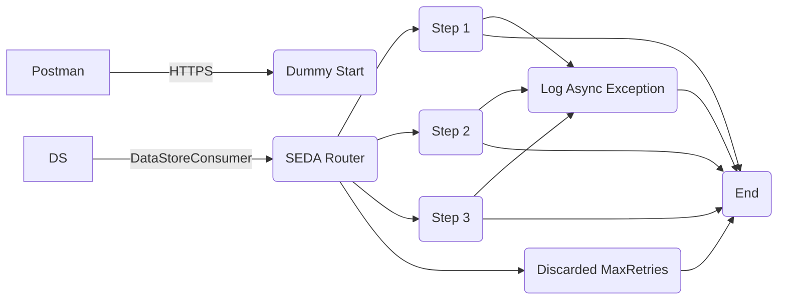

**iFlowId**: SEDA_Model_-_Single_DS_-_Restart_and_Discard_MMZ - **iFlowVersion**: 1.0.1

**Mermaid Diagram**

**BPMN Diagram**

**Functional Summary**
- **Brief description of the iFlow**
This iFlow processes messages, persisting them to a Data Store and routing them through a series of integration processes (Steps 1, 2, and 3). It includes exception handling with logging and custom status updates.  The iFlow allows for message reprocessing with a retry mechanism before discarding the message if the maximum retries are exceeded.  The iFlow can be triggered by a HTTPS call or directly by the DataStore.

- **Involved systems with Adapters Type and Endpoint Type**
    - Postman - HTTPS - Sender
    - DS - DataStoreConsumer - Sender

- **Key steps**
 1.  Receives a message either via HTTPS or DataStore.
 2.  Determines if message re-processing is required.
 3.  Routes messages to Steps 1, 2, or 3 based on the `Step` header.
 4.  Stores messages to datastore, and logs exceptions.
 5.  Updates the message processing log with custom statuses.
 6.  Discard messages if max retries exceeded, and log the event.

- **Message transformation**
    - In "Dummy Start" process, headers are set: `SAP_Sender`, `SAP_Receiver`, `SAP_MessageType`, `Step`. Additionally, a custom status is set based on the `SAP_MessageType`.
    - In "Step 1", "Step 2", and "Step 3", the "Step" header with the corresponding step name is added.
    - Groovy scripts are used to log the discarded message, Log Async Exception.

- **Externalized parameters list, configured values and their descriptions**
    - `MaxRetries`: 3 - Maximum number of retries before discarding a message.
    - `SEDA_MAIN_QUEUE`: SEDA_MODEL_MMZ - Name of the main queue (not used in the iFlow).
    - `Retention Threshold 4 Alerting`: 1 - Retention threshold for alerting.
    - `Retry Interval`: 15 - Interval (in minutes) between retries.
    - `Number of Concurrent Processes`: 1 - Number of concurrent processes (not used in the iFlow).
    - `Data Store Name`: SEDA_MODEL_MMZ - Name of the Data Store.
    - `RoleName`: ESBMessaging.send - Role name for authorization.
    - `Exponential Backoff`: 1 - Exponential backoff flag.
    - `Expiration Period`: 7 - Expiration period (in days).
    - `Lock Timeout`: 10 - Lock timeout (in minutes).
    - `Maximum Retry Interval`: 1440 - Maximum retry interval (in minutes).
    - `Poll Interval`: 10 - Poll interval (in minutes).

- **DataStore / JMS Dependency**
Yes

- **Cloud Connector Dependency**
Not Found

- **Common Scripts Dependency**
    - Log_Discarded_Message.groovy - Groovy_Logging_Scripts
    - Log_Exception_Async.groovy - Groovy_Logging_Scripts

- **ProcessDirect ComponentType Dependency**
Not Found