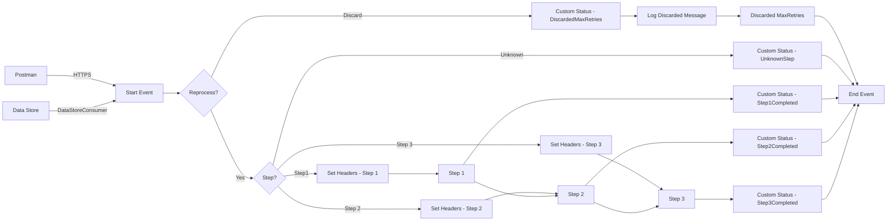

**iFlowId:** SEDA_Model_-_Single_DS_-_Restart_and_Discard_MMZ - **iFlowVersion:** 1.0.1

**Mermaid Diagram**

**BPMN Diagram**

**Functional Summary**
-   **Brief description of the iFlow**
    This iFlow demonstrates a SEDA (Staged Event-Driven Architecture) model with a single Data Store, restart, and discard mechanism. It receives messages either from a Data Store or an HTTPS endpoint, processes them through multiple steps, and stores the processed messages in the Data Store. It also includes error handling and logging capabilities.

-   **Involved systems with Adapters Type and Endpoint Type**
    -   Postman - HTTPS - HTTPS
    -   DS - DataStoreConsumer - JDBC

-   **Key steps**
    1.  Receive message from HTTPS or Data Store.
    2.  Route the message based on the `Step` header.
    3.  Execute Step 1, Step 2, or Step 3 based on routing. These steps prepare messages, set headers, and store the message into the Data Store.
    4.  If `SAP_DataStoreRetries` exceeds `MaxRetries`, the message is discarded.
    5.  Custom Status is created depending on the completed step
    6.  Exception handling is implemented in each step to Log Async Exception.

-   **Message transformation**
    -   The iFlow uses Enrichers to set headers (e.g., `SAP_Sender`, `SAP_Receiver`, `SAP_MessageType`, `Step`) with constant values or expressions.
    -   Custom statuses are created to log on SAP_MessageProcessingLogCustomStatus property.
    -   Prepare Step activities enrich the content with a base64 encoded message.

-   **Externalized parameters list, configured values and their descriptions**
    -   `MaxRetries`: 3 - Maximum number of retries before discarding a message.
    -   `SEDA_MAIN_QUEUE`: SEDA_MODEL_MMZ -  Name of the main queue.
    -   `Retention Threshold 4 Alerting`: 1 - Retention threshold for alerting.
    -   `Retry Interval`: 15 - Interval between retries (likely in seconds).
    -   `Number of Concurrent Processes`: 1 - Number of concurrent processes.
    -   `Data Store Name`: SEDA_MODEL_MMZ - Name of the Data Store.
    -   `RoleName`: ESBMessaging.send - Role name for sender authorization.
    -   `Exponential Backoff`: 1 -  Flag to enable/disable exponential backoff for retries.
    -   `Expiration Period`: 7 - Expiration period for stored data (likely in days).
    -   `Lock Timeout`: 10 - Timeout for file lock operations.
    -   `Maximum Retry Interval`: 1440 - Maximum retry interval.
    -   `Poll Interval`: 10 - Poll interval to get data from Data Store.

-   **DataStore / JMS Dependency**
    Yes

-   **Cloud Connector Dependency**
    Not Found

-   **Common Scripts Dependency**
    -   Log_Discarded_Message.groovy - Groovy_Logging_Scripts
    -   Log_Exception_Async.groovy - Groovy_Logging_Scripts

-   **ProcessDirect ComponentType Dependency**
    Not Found