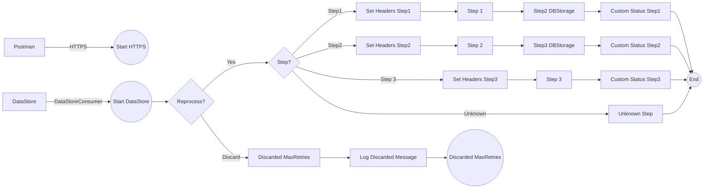

**iFlowId**: SEDA_Model_-_Single_DS_-_Restart_and_Discard_MMZ - **iFlowVersion**: 1.0.1

**Mermaid Diagram**

**Functional Summary**
- **Brief description of the iFlow**
This iFlow demonstrates a SEDA (Staged Event-Driven Architecture) model where messages are processed in multiple steps, stored in a DataStore, and can be retried or discarded based on the number of retries. It includes exception handling and custom logging.

- **Involved systems with Adapters Type and Endpoint Type**
    - Postman (HTTPS Sender)
    - DS (DataStoreConsumer Sender)

- **Key steps**
 1. Receive message via HTTPS or DataStore.
 2. Check retry count; if retry count is exceeded, discard the message.
 3. Route message based on the `Step` header to different processing steps (Step1, Step2, Step3).
 4. Each step prepares and calls a Local Integration Process (Step 1, Step 2, Step 3).
 5. Within each Local Integration Process, additional information is enriched in the message, and in Step3 it can throw an exception.
 6. Store message data in the DataStore at each step using the DBStorage adapter.
 7. Update message status with custom status updates at the end of each step.
 8. Log exceptions asynchronously in case of errors.
 9. If a message reaches the maximum number of retries, it is discarded and logged as a discarded message.

- **Message transformation**
    - Set Headers: Enricher component is used to create and set header values (e.g., SAP_Sender, SAP_Receiver, SAP_MessageType, Step) to route and identify messages within the iFlow.
    - Custom Status: Enricher component is used to create and add custom status messages (SAP_MessageProcessingLogCustomStatus) to the message processing log.
    - Prepare Step: Enricher component sets the Step header, and wrapContent sets a base64 encoded message.

- **Externalized parameters list, configured values and their descriptions**
    - MaxRetries: 3 - Maximum number of retries before a message is discarded.
    - SEDA_MAIN_QUEUE: SEDA_MODEL_MMZ - JMS Queue name (not used in the flow).
    - Retention Threshold 4 Alerting: 1 - Threshold for alerting (DBStorage Alerting, not used in the flow).
    - Retry Interval: 15 - Interval between retries in seconds.
    - Number of Concurrent Processes: 1 -  Number of concurrent process (not used in the flow).
    - Data Store Name: SEDA_MODEL_MMZ - Name of the DataStore used for persistence.
    - RoleName: ESBMessaging.send - Role required for sending messages via HTTPS.
    - Exponential Backoff: 1 - Flag to enable exponential backoff for retries (DBStorage, not used in the flow).
    - Expiration Period: 7 - Expiration period in days for messages stored in the DataStore.
    - Lock Timeout: 10 - Lock timeout in seconds for DataStore access.
    - Maximum Retry Interval: 1440 - Maximum retry interval in minutes for the DataStore consumer.
    - Poll Interval: 10 - Poll interval in seconds for the DataStore consumer.

- **DataStore / JMS Dependency**
Yes

- **Cloud Connector Dependency**
Not Found

- **Common Scripts Dependency**
    - Groovy_Logging_Scripts: Log_Discarded_Message.groovy
    - Groovy_Logging_Scripts: Log_Exception_Async.groovy

- **ProcessDirect ComponentType Dependency**
Not Found