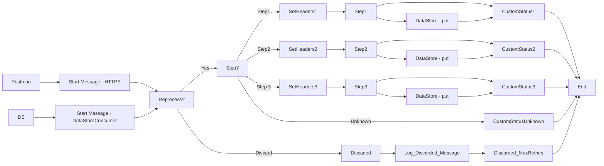

markdown
**iFlowId**: SEDA_Model_-_Single_DS_-_Restart_and_Discard_MMZ - **iFlowVersion**: 1.0.1

**Mermaid Diagram**

**BPMN Diagram**

**Functional Summary**
- **Brief description of the iFlow**
This iFlow processes messages using a SEDA router, storing message data in a Data Store at various steps. The iFlow allows for retries and discarding of messages based on the `MaxRetries` parameter. The iFlow has exception handling for async logging.

- **Involved systems with Adapters Type and Endpoint Type**
    - Postman - HTTPS - Sender
    - DS - DataStoreConsumer - Sender

- **Key steps**
    1. Receive message via HTTPS adapter from Postman.
    2. Determine if the message should be reprocessed based on retries.
    3. Route messages based on the `Step` header to different processing steps (Step1, Step2, Step3), or discard.
    4. Store message in Data Store in steps 1, 2 and 3
    5. If `MaxRetries` are reached the message is discarded.
    6. Completes processing and log custom status per step.

- **Message transformation**
    - Enrichment steps add custom status and headers to the message.
    - Groovy scripts are used for logging exceptions and discarded messages.

- **Externalized parameters list, configured values and their descriptions**
    - `MaxRetries`: 3 - Maximum number of retries before discarding the message.
    - `SEDA_MAIN_QUEUE`: SEDA_MODEL_MMZ - Name of the SEDA queue, not in the provided BPMN XML, read from parameters.prop.
    - `Retention Threshold 4 Alerting`: 1 - Retention threshold for alerting, value in days, not in the provided BPMN XML, read from parameters.prop.
    - `Retry Interval`: 15 - Interval between retry attempts in seconds, value in seconds, not in the provided BPMN XML, read from parameters.prop.
    - `Number of Concurrent Processes`: 1 - Number of concurrent processes, not in the provided BPMN XML, read from parameters.prop.
    - `Data Store Name`: SEDA_MODEL_MMZ - Name of the Data Store.
    - `RoleName`: ESBMessaging.send - Role name for sender authentication.
    - `Exponential Backoff`: 1 - Whether to use exponential backoff for retries, not in the provided BPMN XML, read from parameters.prop.
    - `Expiration Period`: 7 - Expiration period for the Data Store entries in days, not in the provided BPMN XML, read from parameters.prop.
    - `Lock Timeout`: 10 - Lock timeout for Data Store operations in seconds, not in the provided BPMN XML, read from parameters.prop.
    - `Maximum Retry Interval`: 1440 - Maximum retry interval in minutes, not in the provided BPMN XML, read from parameters.prop.
    - `Poll Interval`: 10 - Poll interval for the Data Store consumer in seconds, not in the provided BPMN XML, read from parameters.prop.

- **DataStore / JMS Dependency**
Yes

- **Cloud Connector Dependency**
Not Found

- **Common Scripts Dependency**
    - `Groovy_Logging_Scripts`: Log_Discarded_Message.groovy
    - `Groovy_Logging_Scripts`: Log_Exception_Async.groovy

- **ProcessDirect ComponentType Dependency**
Not Found