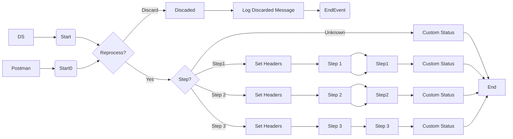

markdown
**iFlowId**: SEDA_Model_-_Single_DS_-_Restart_and_Discard_MMZ - **iFlowVersion**: 1.0.1

**Mermaid Diagram**

**Functional Summary**
- **Brief description of the iFlow**
  This iFlow demonstrates a SEDA (Staged Event-Driven Architecture) model for processing messages. It reads messages from a DataStore, processes them through multiple steps, and stores them back in the DataStore after each step. The iFlow also handles exceptions and discards messages after a maximum number of retries.

- **Involved systems with Adapters Type and Endpoint Type**
  - Postman (HTTPS, EndpointSender)
  - DS (DataStoreConsumer, EndpointSender)

- **Key steps**
 1. Receive message either via HTTPS from Postman or from DataStore.
 2. Check if MaxRetries has been reached, Discard Message if true.
 3. Route the message based on the 'Step' header.
 4. Step 1: Prepare Step 2, store in datastore, set custom status, log.
 5. Step 2: Prepare Step 3, store in datastore, set custom status, log.
 6. Step 3: Execute a groovy script to simulate exception or success. Set custom status, log.
 7. Log Async Exception in case of exceptions.
 8. Messages are stored in the DataStore after each step.

- **Message transformation**
  - Enrichers are used to set headers (SAP_Sender, SAP_Receiver, SAP_MessageType, Step) and custom status (SAP_MessageProcessingLogCustomStatus) at various points in the iFlow.
  - Constant values are added to the header for routing and status tracking.
  - Groovy scripts are used in 'Test Throw Exception' and 'Log Async Exception' for exception handling and logging.

- **Externalized parameters list, configured values and their descriptions**
  - MaxRetries: 3 - Maximum number of retries before discarding a message.
  - SEDA_MAIN_QUEUE: SEDA_MODEL_MMZ - Name of the JMS queue used in the iFlow, not applicable because no JMS adapter is in use.
  - Retention Threshold 4 Alerting: 1 - Retention threshold for alerting.
  - Retry Interval: 15 - Interval between retry attempts (in minutes).
  - Number of Concurrent Processes: 1 - Number of concurrent processes.
  - Data Store Name: SEDA_MODEL_MMZ - Name of the DataStore used for persistence.
  - RoleName: ESBMessaging.send - Role required for sending messages.
  - Exponential Backoff: 1 - Enable Exponential Backoff.
  - Expiration Period: 7 - Expiration period for stored messages (in days).
  - Lock Timeout: 10 - Lock timeout.
  - Maximum Retry Interval: 1440 - Maximum retry interval (in minutes).
  - Poll Interval: 10 - Poll interval (in minutes).

- **DataStore / JMS Dependency**
  Yes

- **Cloud Connector Dependency**
  Not Found

- **Common Scripts Dependency**
  - Log_Discarded_Message.groovy, scriptBundleId: Groovy_Logging_Scripts
  - Log_Exception_Async.groovy, scriptBundleId: Groovy_Logging_Scripts

- **ProcessDirect ComponentType Dependency**
  Not Found