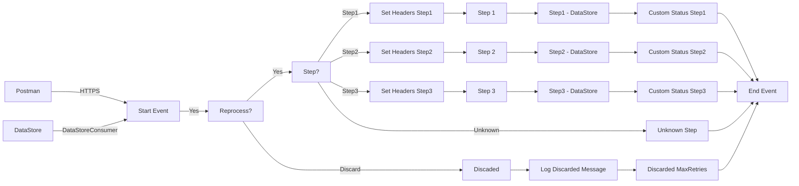

**iFlowId**: SEDA_Model_-_Single_DS_-_Restart_and_Discard_MMZ - **iFlowVersion**: 1.0.1

**Mermaid Diagram**

**BPMN Diagram**

**Functional Summary**
- **Brief description of the iFlow**
This iFlow processes messages from a Data Store, routes them through a series of integration processes (Step 1, Step 2, Step 3), and persists the data back to the Data Store. It includes retry logic for Data Store consumption and a discard mechanism after exceeding the maximum retry attempts. Error handling is implemented at each step, logging asynchronous exceptions.

- **Involved systems with Adapters Type and Endpoint Type**
    - Postman - HTTPS - Sender
    - DS - DataStoreConsumer - Sender

- **Key steps**
    1. Receive message from HTTPS sender or DataStore consumer.
    2. Check retry attempts, discard if exceeded, otherwise proceed.
    3. Route to Step 1, Step 2, or Step 3 based on header "Step".
    4. Execute local Integration Processes "Step 1", "Step 2" and "Step 3".
    5. Enrich message with custom status at different stages.
    6. Persist message to Data Store at different stages.
    7. Log exceptions asynchronously if errors occur.
    8. End the flow.

- **Message transformation**
    - The iFlow uses Enrichers to set headers. The "Set Headers" Enrichers set headers SAP_Sender, SAP_Receiver, SAP_MessageType, and Step. The "Custom Status" enrichers add status messages.
    - The Prepare Step enrichers set the Step header.

- **Externalized parameters list, configured values and their descriptions**
    - MaxRetries: 3 - Maximum number of retries before discarding a message.
    - SEDA_MAIN_QUEUE: SEDA_MODEL_MMZ - JMS Queue Name. This parameter is not in use.
    - Retention Threshold 4 Alerting: 1 - Threshold for alerting on retention period.
    - Retry Interval: 15 - Interval between retry attempts.
    - Number of Concurrent Processes: 1 - Not in use.
    - Data Store Name: SEDA_MODEL_MMZ - Name of the Data Store.
    - RoleName: ESBMessaging.send - Role required for the HTTPS sender.
    - Exponential Backoff: 1 - Indicates whether exponential backoff is enabled.
    - Expiration Period: 7 - Expiration period for messages in the Data Store.
    - Lock Timeout: 10 - Timeout for file lock.
    - Maximum Retry Interval: 1440 - Maximum retry interval for the Data Store consumer.
    - Poll Interval: 10 - Interval for polling the Data Store.

- **DataStore / JMS Dependency**
Yes

- **Cloud Connector Dependency**
Not Found

- **Common Scripts Dependency**
    - Log_Discarded_Message.groovy - Groovy_Logging_Scripts
    - Log_Exception_Async.groovy - Groovy_Logging_Scripts

- **ProcessDirect ComponentType Dependency**
Not Found