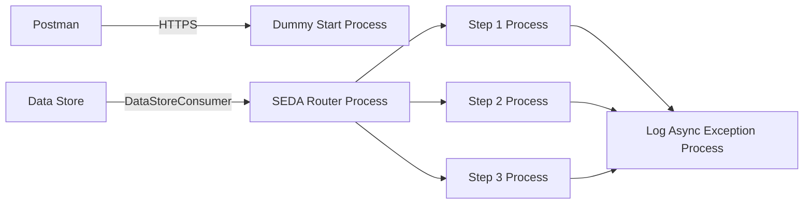

markdown
**iFlowId**: SEDA_Model_-_Single_DS_-_Restart_and_Discard_MMZ - **iFlowVersion**: 1.0.1

**Mermaid Diagram**

**BPMN Diagram**

**Functional Summary**
- **Brief description of the iFlow**
This iFlow processes messages through a series of steps, leveraging a Data Store for persistence and a SEDA (Staged Event-Driven Architecture) router for message routing. It includes exception handling and retry mechanisms, ultimately discarding messages that exceed the maximum retry attempts.

- **Involved systems with Adapters Type and Endpoint Type**
    - Postman - HTTPS - EndpointSender
    - DS - DataStoreConsumer - EndpointSender

- **Key steps**
 1.  Receive message via HTTPS.
 2.  Store the message in Data Store (Step1)
 3.  Route the message based on the `Step` header to different steps: Step1, Step2, Step3, Unknown.
 4.  Each Step Process calls a directCall process.
 5.  If the maximum number of retries (`MaxRetries`) is exceeded, the message is discarded.
 6.  Log the exception in case any error occurs.

- **Message transformation**
    - Enricher: Adds headers to the message at various stages.
    - Groovy Script: Log Discarded message and Log Exception Async.
    - Content Modifier: Prepare each step with the specific header values.

- **Externalized parameters list, configured values and their descriptions**
    - `MaxRetries`: 3 - Maximum number of retries before discarding a message.
    - `SEDA_MAIN_QUEUE`: SEDA_MODEL_MMZ - JMS queue name for SEDA router. (Not used, there is no JMS adapter)
    - `Retention Threshold 4 Alerting`: 1 - Threshold for alerting on data retention.
    - `Retry Interval`: 15 - Interval between retry attempts (in minutes).
    - `Number of Concurrent Processes`: 1 - Number of concurrent processes.
    - `Data Store Name`: SEDA_MODEL_MMZ - Name of the Data Store used for persistence.
    - `RoleName`: ESBMessaging.send - Role required for sending messages.
    - `Exponential Backoff`: 1 - Exponential backoff enabled/disabled.
    - `Expiration Period`: 7 - Expiration period for stored messages (in days).
    - `Lock Timeout`: 10 - Timeout for locking data store entries.
    - `Maximum Retry Interval`: 1440 - Maximum retry interval.
    - `Poll Interval`: 10 - Interval for polling the Data Store.

- **DataStore / JMS Dependency**
Yes

- **Cloud Connector Dependency**
Not Found

- **Common Scripts Dependency**
    - Groovy_Logging_Scripts - Log_Discarded_Message.groovy
    - Groovy_Logging_Scripts - Log_Exception_Async.groovy

- **ProcessDirect ComponentType Dependency**
Not Found