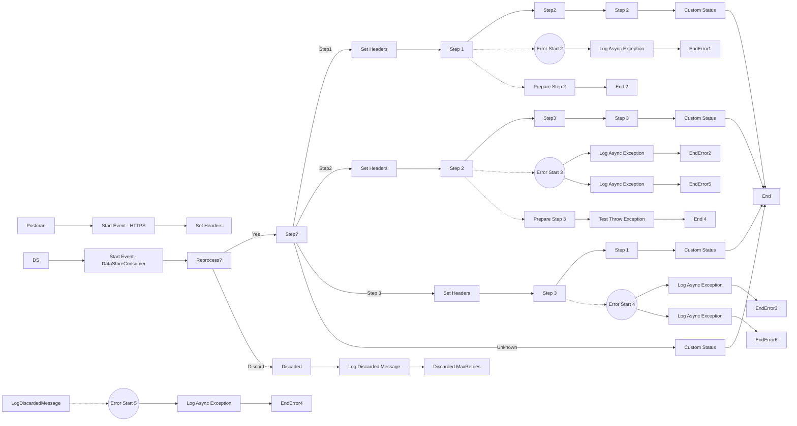

**iFlowId**: SEDA_Model_-_Single_DS_-_Restart_and_Discard_MMZ - **iFlowVersion**: 1.0.1

**Mermaid Diagram**

**BPMN Diagram**

**Functional Summary**
- **Brief description of the iFlow**
This iFlow processes messages using SEDA (Staged Event-Driven Architecture). It retrieves messages from a Data Store, processes them through several steps (Step 1, Step 2, Step 3), and then stores the results back in the Data Store or discards them based on retry counts. It handles exceptions asynchronously and logs them. The process can be triggered by an HTTPS call or from a Data Store.

- **Involved systems with Adapters Type and Endpoint Type**
    - Postman - HTTPS - Sender
    - DS - DataStoreConsumer - Sender

- **Key steps**
    1.  The iFlow is initiated either by an HTTPS request or by consuming a message from a Data Store.
    2.  If initiated by HTTPS, headers are set to define the initial step and other metadata. The message is then stored in the Data Store.
    3.  If initiated by Data Store the iFlow checks if the message should be reprocessed or discarded based on the number of retries.
    4.  The message proceeds through Step 1, Step 2, and Step 3 local integration processes. Each step sets headers to indicate the current processing stage and stores the message in the Data Store.
    5.  After each step, a custom status is added to the message processing log to indicate completion.
    6.  Exceptions occurring during any step are caught and logged asynchronously.
    7.  Messages exceeding the maximum retry count are discarded after logging.
    8.  Finally, the iFlow ends after processing all steps or after discarding the message.

- **Message transformation**
    - Enricher activities are used to add headers and custom status messages at various stages of the iFlow.
    - Groovy scripts are used to log discarded messages and exceptions asynchronously.
    - The "Prepare Step" activities (e.g., "Prepare Step 2") wrap the message content in an XML Envelope.

- **Externalized parameters list, configured values and their descriptions**
    - MaxRetries: 3 - Maximum number of retries before discarding a message.
    - SEDA_MAIN_QUEUE: SEDA_MODEL_MMZ - Name of the SEDA queue (not used as no JMS Adapter)
    - Retention Threshold 4 Alerting: 1 - Retention threshold for alerting.
    - Retry Interval: 15 - Interval between retries.
    - Number of Concurrent Processes: 1 - Number of concurrent processes.
    - Data Store Name: SEDA_MODEL_MMZ - Name of the Data Store.
    - RoleName: ESBMessaging.send - Role name for authentication.
    - Exponential Backoff: 1 - Flag to enable exponential backoff.
    - Expiration Period: 7 - Expiration period for messages in the Data Store.
    - Lock Timeout: 10 - Lock timeout for Data Store operations.
    - Maximum Retry Interval: 1440 - Maximum retry interval.
    - Poll Interval: 10 - Poll interval for the Data Store Consumer.

- **DataStore / JMS Dependency**
Yes

- **Cloud Connector Dependency**
Not Found

- **Common Scripts Dependency**
    - Log_Discarded_Message.groovy - Groovy_Logging_Scripts
    - Log_Exception_Async.groovy - Groovy_Logging_Scripts

- **ProcessDirect ComponentType Dependency**
Not Found