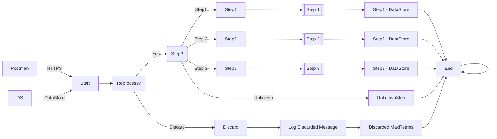

**iFlowId**: SEDA_Model_-_Single_DS_-_Restart_and_Discard_MMZ - **iFlowVersion**: 1.0.1

**Mermaid Diagram**

**BPMN Diagram**

**Functional Summary**
- **Brief description of the iFlow**
This iFlow processes messages from a DataStore or HTTPS endpoint, enriches them with headers, stores them in a DataStore for asynchronous processing, and logs exceptions. It also includes retry logic with a discard option after exceeding the maximum retry attempts.

- **Involved systems with Adapters Type and Endpoint Type**
    - Postman - HTTPS - HTTPS (Sender)
    - DS - DataStoreConsumer - JDBC (Sender)

- **Key steps**
    1. Receives message either from HTTPS endpoint or DataStore.
    2. Based on the 'Step' header, the message is routed to different steps (Step1, Step2, Step3) for processing.
    3. Each step sets specific headers (SAP_Sender, SAP_Receiver, SAP_MessageType) to enrich the message.
    4. Each step stores the message in DataStore.
    5. After each storage, a custom status is set, and the message is sent to End event.
    6. If the 'Step' header is not recognized, a custom status "UnknownStep" is set.
    7. If the `SAP_DataStoreRetries` header exceeds `MaxRetries`, the message is discarded and logged with a "DiscardedMaxRetries" status.
    8. Exceptions during processing are caught, logged asynchronously, and the process is terminated.

- **Message transformation**
    - The iFlow uses "Enricher" components to add or modify headers such as `SAP_Sender`, `SAP_Receiver`, `SAP_MessageType`, and `SAP_MessageProcessingLogCustomStatus`.
    - It constructs the message body for "Prepare Step" based on the step number.
    - The DataStore component includes message headers when storing data.

- **Externalized parameters list, configured values and their descriptions**
    - `MaxRetries`: 3 - Maximum number of retries before discarding the message.
    - `SEDA_MAIN_QUEUE`: SEDA_MODEL_MMZ - Name of the JMS queue.
    - `Retention Threshold 4 Alerting`: 1 - Retention threshold for alerting.
    - `Retry Interval`: 15 - Interval between retry attempts.
    - `Number of Concurrent Processes`: 1 - Number of concurrent processes.
    - `Data Store Name`: SEDA_MODEL_MMZ - Name of the data store used for persistence.
    - `RoleName`: ESBMessaging.send - Role required to send messages.
    - `Exponential Backoff`: 1 - Flag indicating whether exponential backoff is enabled.
    - `Expiration Period`: 7 - Expiration period for stored messages.
    - `Lock Timeout`: 10 - Timeout for locking data store entries.
    - `Maximum Retry Interval`: 1440 - Maximum interval between retries.
    - `Poll Interval`: 10 - Polling interval for DataStoreConsumer.

- **DataStore / JMS Dependency**
    Yes

- **Cloud Connector Dependency**
    Not Found

- **Common Scripts Dependency**
    - Log_Exception_Async.groovy - Groovy_Logging_Scripts
    - Log_Discarded_Message.groovy - Groovy_Logging_Scripts

- **ProcessDirect ComponentType Dependency**
    Not Found