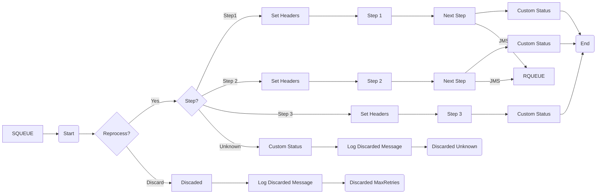

**iFlowId**: SEDA_Model_-_Single_Queue_-_Restart_and_Discard_MMZ - **iFlowVersion**: 1.0.0

**Mermaid Diagram**

**Functional Summary**
- **Brief description of the iFlow**
This iFlow implements a SEDA (Staged Event-Driven Architecture) model using a single JMS queue for asynchronous processing. It receives messages, processes them through a series of steps (Step 1, Step 2, Step 3), and handles exceptions by logging them. The iFlow also implements a retry mechanism and discards messages exceeding the maximum retry count or having an unknown processing step.

- **Involved systems with Adapters Type and Endpoint Type**
    - SQUEUE - JMS - EndpointSender
    - Postman - HTTPS - EndpointSender
    - RQUEUE - JMS - EndpointRecevier

- **Key steps**
    1. Receive message from the SQUEUE system via JMS adapter.
    2. Check if the message needs to be reprocessed and route it to the appropriate step based on the `Step` property: Step1, Step2, Step3 or Discard it if it has an unknown step.
    3. Each step (Step 1, Step 2, Step 3) sets the `Step` property and calls another integration process to perform specific operations.
    4. The SEDA Router calls subsequent steps in an asynchronous manner using the JMS adapter to send messages to the RQUEUE system.
    5. If a step has an exception, log the exception in the process and log the exception asynchronously calling Log Async Exception iFlow.

- **Message transformation**
    - Enrichers are used to set headers (SAP_Sender, SAP_Receiver, SAP_MessageType) and properties (Step) at various stages of the iFlow.
    - There are no explicit content modifiers

- **Externalized parameters list and their descriptions**
    - `SEDA_MAIN_QUEUE`: Queue name for JMS communication, used for both inbound and outbound messaging.
    - `Number of Concurrent Processes`: Specifies the number of concurrent processes for JMS adapter.
    - `Maximum Retry Interval`: Maximum time interval between retries.
    - `Retry Interval`: Time interval for retries.
    - `MaxRetries`: Maximum number of retries before discarding a message.
    - `Retention Threshold 4 Alerting`: Retention threshold for alerting purposes, related to JMS queues.
    - `Expiration Period`: Expiration period for messages in the JMS queue.

- **DataStore / JMS Dependency**
Yes

- **Cloud Connector Dependency**
Not Found

- **Common Scripts Dependency**
    - Groovy_Logging_Scripts:
        - Log_Discarded_Message.groovy
        - Log_Exception_Async.groovy

- **ProcessDirect ComponentType Dependency**
Not Found