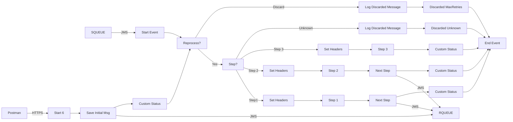

**iFlowId**: SEDA_Model_-_Single_Queue_-_Restart_and_Discard_MMZ - **iFlowVersion**: 1.0.0

**Mermaid Diagram**

**Functional Summary**
- **Brief description of the iFlow**
This iFlow implements a SEDA (Staged Event-Driven Architecture) pattern using a single JMS queue. It receives messages, processes them in multiple steps (Step 1, Step 2, Step 3), and handles exceptions. The iFlow also includes retry and discard mechanisms for failed messages.

- **Involved systems with Adapters Type and Endpoint Type**
    - SQUEUE: JMS, EndpointSender
    - Postman: HTTPS, EndpointSender
    - RQUEUE: JMS, EndpointRecevier

- **Key steps**
    1. Receive message from SQUEUE via JMS adapter.
    2. Determine the current step of the message based on the `Step` property.
    3. Based on the `Step` property, call the corresponding local integration process (Step 1, Step 2, or Step 3).
    4. Each step prepares the message for the next step and sets the `Step` property accordingly.
    5. Send the message to the next step via JMS adapter.
    6. If the message exceeds the maximum retry count, discard the message.
    7. If the step is unknown, discard the message.
    8. Log exceptions and discarded messages.
    9. Dummy Start process to start the flow via HTTPS.

- **Message transformation**
    - Enricher activities are used to set headers (SAP_Sender, SAP_Receiver, SAP_MessageType) and properties (Step) to control the routing and processing of the message.
    - Enricher activities are used to set custom status messages for monitoring.
    - Groovy scripts are used to log exceptions and discarded messages.
    - Prepare Step X enrichers are used to set the Step property and message content for the next step.

- **Externalized parameters list and their descriptions**
    - SEDA_MAIN_QUEUE: The name of the JMS queue used for message exchange.
    - Number of Concurrent Processes: Number of concurrent processes for JMS adapter.
    - Maximum Retry Interval: Maximum retry interval for JMS adapter.
    - Retention Threshold 4 Alerting: Retention threshold for alerting for JMS adapter.
    - Expiration Period: Expiration period for JMS adapter.
    - Retry Interval: Retry interval for JMS adapter.
    - MaxRetries: Maximum number of retries before discarding a message.

- **DataStore / JMS Dependency**
Yes

- **Cloud Connector Dependency**
Not Found

- **Common Scripts Dependency**
    - Groovy_Logging_Scripts/Log_Discarded_Message.groovy
    - Groovy_Logging_Scripts/Log_Exception_Async.groovy

- **ProcessDirect ComponentType Dependency**
Not Found