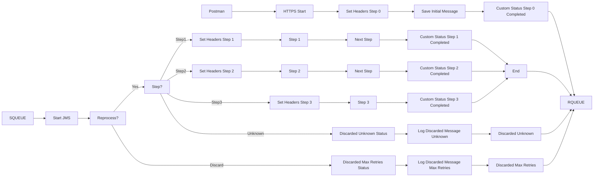

**iFlowId**: SEDA_Model_-_Single_Queue_-_Restart_and_Discard_MMZ - **iFlowVersion**: 1.0.0

**Mermaid Diagram**

**Functional Summary**
- **Brief description of the iFlow**
This iFlow implements a SEDA (Staged Event-Driven Architecture) pattern using a single JMS queue. It receives messages, processes them in multiple steps (Step 1, Step 2, Step 3), and handles exceptions. Messages can be reprocessed or discarded based on retry attempts.

- **Involved systems with Adapters Type and Endpoint Type**
    - SQUEUE: JMS (EndpointSender)
    - RQUEUE: JMS (EndpointRecevier)
    - Postman: HTTPS (EndpointSender)

- **Key steps**
    1. Receive message from SQUEUE via JMS adapter.
    2. Determine the next step based on the `Step` property.
    3. Execute Step 1, Step 2, or Step 3 based on the `Step` property. Each step prepares the message for the next step and sets the `Step` property accordingly.
    4. If the `Step` property is unknown, discard the message.
    5. If the message exceeds the maximum retry attempts, discard the message.
    6. Log exceptions asynchronously.
    7. Send message to RQUEUE via JMS adapter.

- **Message transformation**
    - The iFlow uses Enrichers to set headers (SAP_Sender, SAP_Receiver, SAP_MessageType) and properties (Step) to route messages between steps.
    - Each step prepares the message for the next step by setting the `Step` property and potentially modifying the message body.
    - Custom statuses are added to the message processing log.

- **Externalized parameters list and their descriptions**
    - SEDA_MAIN_QUEUE: JMS Queue Name for inbound and outbound messages.
    - Number of Concurrent Processes: Number of concurrent processes for the JMS adapter.
    - Maximum Retry Interval: Maximum retry interval for the JMS adapter.
    - Retry Interval: Retry interval for the JMS adapter.
    - Retention Threshold 4 Alerting: Retention threshold for alerting in the JMS adapter.
    - Expiration Period: Expiration period for messages in the JMS adapter.
    - MaxRetries: Maximum number of retries before discarding the message.

- **DataStore / JMS Dependency**
Yes

- **Cloud Connector Dependency**
Not Found

- **Common Scripts Dependency**
    - Groovy_Logging_Scripts/Log_Discarded_Message.groovy
    - Groovy_Logging_Scripts/Log_Exception_Async.groovy

- **ProcessDirect ComponentType Dependency**
Not Found