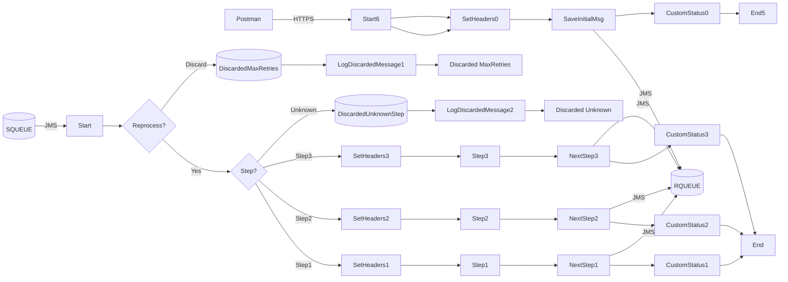

markdown
**iFlowId**: SEDA_Model_-_Single_Queue_-_Restart_and_Discard_MMZ - **iFlowVersion**: 1.0.0

**Mermaid Diagram**

**Functional Summary**
-   **Brief description of the iFlow**
    This iFlow implements a SEDA (Staged Event-Driven Architecture) pattern with a single JMS queue. It receives messages, processes them through multiple steps, and handles exceptions. Messages can be reprocessed or discarded based on retry attempts.

-   **Involved systems with Adapters Type and Endpoint Type**
    -   SQUEUE: JMS (EndpointSender)
    -   RQUEUE: JMS (EndpointRecevier)
    -   Postman: HTTPS (EndpointSender)

-   **Key steps**
    1.  Receive message from SQUEUE via JMS.
    2.  Determine if the message should be reprocessed or discarded based on the `SAPJMSRetries` header and `MaxRetries` parameter.
    3.  Route the message to different processing steps (Step 1, Step 2, Step 3) based on the `Step` property.
    4.  Each step prepares the message, calls a local integration process, and sets a custom status.
    5.  If an exception occurs in any step, log the exception and set a custom status.
    6.  If the message is discarded, log the discarded message.
    7.  Send message to RQUEUE via JMS.

-   **Message transformation**
    -   The iFlow uses Enrichers to set headers and properties.
    -   Each step prepares the message by setting the `Step` property.
    -   Groovy scripts are used to log discarded messages and exceptions.

-   **Externalized parameters list and their descriptions**
    -   `SEDA_MAIN_QUEUE`: The name of the JMS queue used for message processing.
    -   `Number of Concurrent Processes`: Number of concurrent processes for JMS adapter.
    -   `Maximum Retry Interval`: Maximum retry interval for JMS adapter.
    -   `Retention Threshold 4 Alerting`: Retention threshold for alerting in JMS adapter.
    -   `Expiration Period`: Expiration period for JMS adapter.
    -   `Retry Interval`: Retry interval for JMS adapter.
    -   `MaxRetries`: Maximum number of retries before discarding the message.

-   **DataStore / JMS Dependency**
    Yes

-   **Cloud Connector Dependency**
    Not Found

-   **Common Scripts Dependency**
    -   Groovy_Logging_Scripts: Log_Discarded_Message.groovy
    -   Groovy_Logging_Scripts: Log_Exception_Async.groovy

-   **ProcessDirect ComponentType Dependency**
    Not Found