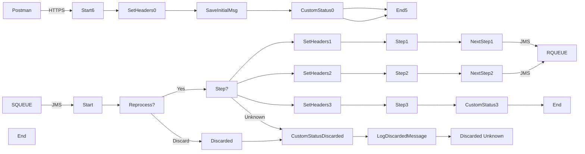

**iFlowId**: SEDA_Model_-_Single_Queue_-_Restart_and_Discard_MMZ - **iFlowVersion**: 1.0.0

**Mermaid Diagram**

**Functional Summary**
- **Brief description of the iFlow**
This iFlow implements a SEDA (Staged Event-Driven Architecture) pattern with a single JMS queue. It receives messages via JMS or HTTPS, processes them in multiple steps, and handles exceptions by logging them and optionally discarding the message after a maximum number of retries.

- **Involved systems with Adapters Type and Endpoint Type**
    - SQUEUE: JMS (EndpointSender)
    - Postman: HTTPS (EndpointSender)
    - RQUEUE: JMS (EndpointRecevier)

- **Key steps**
    1.  Receive message via JMS from SQUEUE or HTTPS from Postman.
    2.  Route messages based on the "Step" property.
    3.  Process messages in three steps (Step 1, Step 2, Step 3), each implemented as a separate local integration process.
    4.  Each step prepares the message for the next step using an Enricher.
    5.  After each step the message is sent to the RQUEUE queue to be picked up by the next step.
    6.  If the message fails after exceeding maximum retries, discard the message, log details.
    7.  If the message property "Step" doesn't match, the message is discarded

- **Message transformation**
    - Enricher components in each step prepare the message for the next step by setting headers and body content.
    - Set Headers components set headers like `SAP_Sender`, `SAP_Receiver`, and `SAP_MessageType`.
    - Custom Status components set the `SAP_MessageProcessingLogCustomStatus`.

- **Externalized parameters list and their descriptions**
    - SEDA_MAIN_QUEUE: The JMS queue used for message exchange between steps.
    - Number of Concurrent Processes: Number of concurrent processes for JMS Adapter.
    - Maximum Retry Interval: Maximum Retry Interval for JMS Adapter.
    - Expiration Period: Expiration Period for JMS Adapter.
    - Retention Threshold 4 Alerting: Retention Threshold 4 Alerting for JMS Adapter.
    - Retry Interval: Retry Interval for JMS Adapter.
    - MaxRetries: The maximum number of retries before a message is discarded.

- **DataStore / JMS Dependency**
Yes

- **Cloud Connector Dependency**
Not Found

- **Common Scripts Dependency**
    - Groovy_Logging_Scripts:
        - Log_Discarded_Message.groovy
        - Log_Exception_Async.groovy

- **ProcessDirect ComponentType Dependency**
Not Found