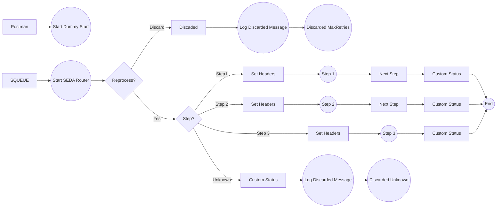

**iFlowId**: SEDA_Model_-_Single_Queue_-_Restart_and_Discard_MMZ - **iFlowVersion**: 1.0.0

**Mermaid Diagram**

**Functional Summary**
- **Brief description of the iFlow**
This iFlow implements a SEDA (Staged Event-Driven Architecture) pattern with a single queue. It receives messages, processes them in multiple steps, and handles exceptions by logging them and discarding messages that exceed the maximum retry count or have an unknown processing step.

- **Involved systems with Adapters Type and Endpoint Type**
    - Postman - HTTPS - EndpointSender
    - SQUEUE - JMS - EndpointSender
    - RQUEUE - JMS - EndpointRecevier

- **Key steps**
    1. Receive message via HTTPS or JMS.
    2. Determine the processing step based on a property.
    3. Execute the corresponding processing step (Step 1, Step 2, or Step 3).
    4. Log exceptions and discard messages exceeding retry limits or with unknown steps.
    5. Send message to the next step via JMS.

- **Message transformation**
    - The iFlow uses Enrichers to set headers and properties for message routing and logging.
    - Step 1, Step 2 and Step 3 processes use Enrichers to prepare the message body with a base64 encoded message.

- **Externalized parameters list and their descriptions**
    - `SEDA_MAIN_QUEUE`: Name of the JMS queue used for message exchange between steps.
    - `Number of Concurrent Processes`: Number of concurrent processes for the JMS adapter.
    - `Maximum Retry Interval`: Maximum retry interval for the JMS adapter.
    - `Retry Interval`: Retry interval for the JMS adapter.
    - `Retention Threshold 4 Alerting`: Retention threshold for alerting in the JMS adapter.
    - `Expiration Period`: Expiration period for messages in the JMS adapter.
    - `MaxRetries`: Maximum number of retries before discarding a message.

- **DataStore / JMS Dependency**
Yes

- **Cloud Connector Dependency**
Not Found

- **Common Scripts Dependency**
    - Groovy_Logging_Scripts/Log_Discarded_Message.groovy
    - Groovy_Logging_Scripts/Log_Exception_Async.groovy

- **ProcessDirect ComponentType Dependency**
Not Found