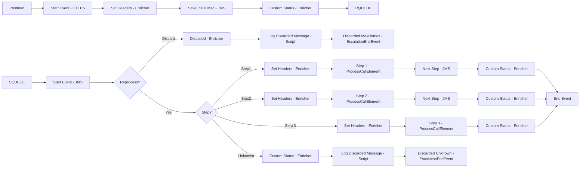

**iFlowId**: SEDA_Model_-_Single_Queue_-_Restart_and_Discard_MMZ - **iFlowVersion**: 1.0.0

**Mermaid Diagram**

**Functional Summary**
- **Brief description of the iFlow**
This iFlow implements a SEDA (Staged Event-Driven Architecture) pattern using a single JMS queue. It receives messages, processes them in multiple steps (Step 1, Step 2, Step 3), and handles exceptions by logging them. The iFlow also includes logic to discard messages that exceed a maximum retry count or have an unknown processing step.

- **Involved systems with Adapters Type and Endpoint Type**
    - SQUEUE: JMS, EndpointSender
    - Postman: HTTPS, EndpointSender
    - RQUEUE: JMS, EndpointRecevier

- **Key steps**
    1.  Receive message from SQUEUE via JMS adapter.
    2.  Determine the current processing step based on the `Step` property.
    3.  Based on the step, call the corresponding local integration process (Step 1, Step 2, or Step 3).
    4.  Within each step, perform specific processing logic.
    5.  After each step, update the `SAP_MessageProcessingLogCustomStatus`.
    6.  If an exception occurs in any step, log the exception.
    7.  If the message exceeds the maximum retry count, discard the message and log it.
    8.  If the step is unknown, discard the message and log it.
    9.  Send message to RQUEUE via JMS adapter.

- **Message transformation**
    - Enricher activities are used to set headers (SAP_Sender, SAP_Receiver, SAP_MessageType) and custom status (SAP_MessageProcessingLogCustomStatus) at various stages of the iFlow.
    - Prepare Step 2 and Prepare Step 3 enrichers set the Step property and wrap the message content.

- **Externalized parameters list and their descriptions**
    - SEDA_MAIN_QUEUE: The name of the JMS queue used for message processing.
    - Number of Concurrent Processes: The number of concurrent processes for the JMS adapter.
    - Maximum Retry Interval: The maximum retry interval for the JMS adapter.
    - Retention Threshold 4 Alerting: Retention threshold for alerting.
    - Expiration Period: Expiration period for messages.
    - Retry Interval: Retry interval for the JMS adapter.
    - MaxRetries: Maximum number of retries before discarding a message.

- **DataStore / JMS Dependency**
Yes

- **Cloud Connector Dependency**
Not Found

- **Common Scripts Dependency**
    - Groovy_Logging_Scripts/Log_Discarded_Message.groovy
    - Groovy_Logging_Scripts/Log_Exception_Async.groovy

- **ProcessDirect ComponentType Dependency**
Not Found