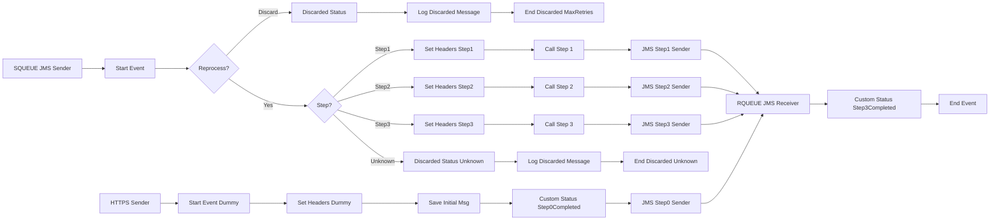

markdown
**iFlowId**: SEDA_Model_-_Single_Queue_-_Restart_and_Discard_MMZ - **iFlowVersion**: 1.0.0

**Mermaid Diagram**

**Functional Summary**
- **Brief description of the iFlow**
This iFlow implements a SEDA (Staged Event-Driven Architecture) pattern using a single JMS queue. It receives messages, processes them through a series of steps (Step 1, Step 2, Step 3), and handles potential exceptions. It also includes retry logic and a mechanism to discard messages that exceed the maximum retry attempts or encounter unknown steps.

- **Involved systems with Adapters Type and Endpoint Type**
    - SQUEUE: JMS (EndpointSender)
    - Postman: HTTPS (EndpointSender)
    - RQUEUE: JMS (EndpointRecevier)

- **Key steps**
    1. Receive message from SQUEUE via JMS adapter.
    2. Determine the next processing step based on the `Step` property.
    3. Execute the corresponding step (Step 1, Step 2, or Step 3) by calling a local integration process. Each step prepares the message, potentially throws an exception, and then completes.
    4. After each step, update the message processing log with a custom status.
    5. If the `Step` property is unknown, discard the message.
    6. If the message exceeds the maximum retry attempts, discard the message.
    7. Send the message to the next step via JMS adapter.

- **Message transformation**
    - The iFlow uses Enrichers to set headers (SAP_Sender, SAP_Receiver, SAP_MessageType) and properties (Step) at various stages.
    - Each step (Step 1, Step 2, Step 3) prepares the message by setting the `Step` property to the next step.
    - Groovy scripts are used to log discarded messages and exceptions.

- **Externalized parameters list and their descriptions**
    - SEDA_MAIN_QUEUE: The name of the JMS queue used for message processing.
    - Number of Concurrent Processes: The number of concurrent processes for the JMS adapter.
    - Maximum Retry Interval: The maximum retry interval for the JMS adapter.
    - Retention Threshold 4 Alerting: Retention threshold for alerting.
    - Expiration Period: Expiration period for messages.
    - Retry Interval: The retry interval for the JMS adapter.
    - MaxRetries: The maximum number of retries before discarding a message.

- **DataStore / JMS Dependency**
Yes

- **Cloud Connector Dependency**
Not Found

- **Common Scripts Dependency**
    - Log_Discarded_Message.groovy
    - Log_Exception_Async.groovy
    - script1.groovy

- **ProcessDirect ComponentType Dependency**
Not Found