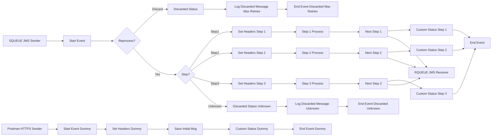

markdown
**iFlowId**: SEDA_Model_-_Single_Queue_-_Restart_and_Discard_MMZ - **iFlowVersion**: 1.0.0

**Mermaid Diagram**

**Functional Summary**
- **Brief description of the iFlow**
This iFlow implements a SEDA (Staged Event-Driven Architecture) pattern with a single JMS queue. It receives messages, processes them in multiple steps (Step 1, Step 2, Step 3), and handles exceptions by logging them. The iFlow also includes logic to discard messages after a certain number of retries or if the receiver is not found.

- **Involved systems with Adapters Type and Endpoint Type**
    - SQUEUE: JMS, EndpointSender
    - Postman: HTTPS, EndpointSender
    - RQUEUE: JMS, EndpointRecevier

- **Key steps**
    1. Receive message from SQUEUE via JMS adapter.
    2. Determine the next step based on the `Step` property.
    3. Call the corresponding process (Step 1, Step 2, or Step 3).
    4. Within each step, prepare the message for the next step and set relevant headers.
    5. Send the message to RQUEUE via JMS adapter.
    6. If the `Step` property is unknown, discard the message.
    7. If the maximum number of retries is exceeded, discard the message.
    8. Log any exceptions that occur during processing.

- **Message transformation**
    - The iFlow uses Enrichers to set headers and properties on the message.
    - Each step prepares the message for the next step by setting the `Step` property and message content.
    - Groovy scripts are used to log discarded messages and exceptions.

- **Externalized parameters list and their descriptions**
    - `SEDA_MAIN_QUEUE`: The name of the JMS queue used for message processing.
    - `Number of Concurrent Processes`: Number of concurrent processes for the JMS adapter.
    - `Maximum Retry Interval`: Maximum retry interval for the JMS adapter.
    - `Retention Threshold 4 Alerting`: Retention threshold for alerting in the JMS adapter.
    - `Expiration Period`: Expiration period for messages in the JMS adapter.
    - `Retry Interval`: Retry interval for the JMS adapter.
    - `MaxRetries`: Maximum number of retries before discarding a message.

- **DataStore / JMS Dependency**
Yes

- **Cloud Connector Dependency**
Not Found

- **Common Scripts Dependency**
    - Log_Discarded_Message.groovy (scriptBundleId: Groovy_Logging_Scripts)
    - Log_Exception_Async.groovy (scriptBundleId: Groovy_Logging_Scripts)
    - script1.groovy (scriptBundleId: Not Found)

- **ProcessDirect ComponentType Dependency**
Not Found