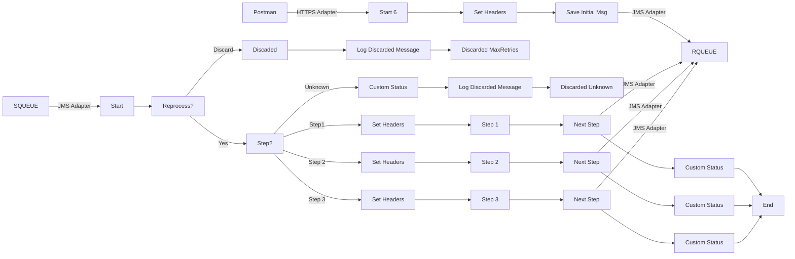

**iFlowId**: SEDA_Model_-_Single_Queue_-_Restart_and_Discard_MMZ - **iFlowVersion**: 1.0.0

**Mermaid Diagram**

**Functional Summary**
- **Brief description of the iFlow**
This iFlow implements a SEDA (Staged Event-Driven Architecture) pattern using a single JMS queue. It receives messages, processes them in multiple steps (Step 1, Step 2, Step 3), and handles exceptions. Messages can be reprocessed or discarded based on the number of retries.

- **Involved systems with Adapters Type and Endpoint Type**
    - SQUEUE: JMS Adapter, EndpointSender
    - Postman: HTTPS Adapter, EndpointSender
    - RQUEUE: JMS Adapter, EndpointRecevier

- **Key steps**
    1. Receive message from SQUEUE via JMS.
    2. Determine the current processing step based on the `Step` property.
    3. Execute the corresponding step (Step 1, Step 2, or Step 3) by calling a local integration process.
    4. Within each step, prepare the message for the next step and set relevant headers.
    5. Send the message to the next step via JMS to RQUEUE.
    6. If the `Step` property is unknown, discard the message.
    7. If the maximum number of retries is exceeded, discard the message.
    8. Log exceptions and discarded messages.

- **Message transformation**
    - Enricher components are used to set headers (SAP_Sender, SAP_Receiver, SAP_MessageType) and custom status messages.
    - Groovy scripts are used to log discarded messages and exceptions.
    - Each step prepares the message for the next step by setting the `Step` property and message content.

- **Externalized parameters list and their descriptions**
    - SEDA_MAIN_QUEUE: JMS Queue Name for inbound and outbound messages.
    - Number of Concurrent Processes: Number of concurrent processes for the JMS receiver adapter.
    - Maximum Retry Interval: Maximum retry interval for the JMS receiver adapter.
    - Retry Interval: Retry interval for the JMS receiver adapter.
    - Retention Threshold 4 Alerting: Retention threshold for alerting in JMS adapter.
    - Expiration Period: Expiration period for messages in JMS adapter.
    - MaxRetries: Maximum number of retries before discarding the message.

- **DataStore / JMS Dependency**
Yes

- **Cloud Connector Dependency**
Not Found

- **Common Scripts Dependency**
    - Groovy_Logging_Scripts/Log_Discarded_Message.groovy
    - Groovy_Logging_Scripts/Log_Exception_Async.groovy

- **ProcessDirect ComponentType Dependency**
Not Found