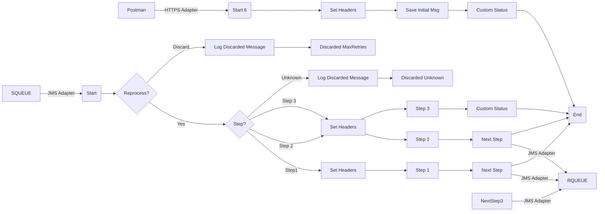

**iFlowId**: SEDA_Model_-_Single_Queue_-_Restart_and_Discard_MMZ - **iFlowVersion**: 1.0.0

**Mermaid Diagram**

**Functional Summary**
- **Brief description of the iFlow**
This iFlow implements a SEDA (Staged Event-Driven Architecture) pattern using a single JMS queue. It receives messages, processes them in multiple steps (Step 1, Step 2, Step 3), and handles exceptions by logging them. The iFlow also includes logic to discard messages after a certain number of retries or if the receiver is unknown.

- **Involved systems with Adapters Type and Endpoint Type**
    - SQUEUE: JMS Adapter, EndpointSender
    - Postman: HTTPS Adapter, EndpointSender
    - RQUEUE: JMS Adapter, EndpointRecevier

- **Key steps**
    1. Receive message from SQUEUE via JMS adapter.
    2. Determine the next processing step based on the `Step` property.
    3. Call the corresponding local integration process (Step 1, Step 2, or Step 3).
    4. Within each step, prepare the message for the next step by setting headers and content.
    5. Send the message to RQUEUE via JMS adapter for the next step.
    6. If the maximum number of retries is exceeded, discard the message and log it.
    7. If the step is unknown, discard the message and log it.
    8. Log any exceptions that occur during processing.
    9. Start the iFlow via HTTPS adapter.
    10. Save the initial message.

- **Message transformation**
    - The iFlow uses Enrichers to set headers (SAP_Sender, SAP_Receiver, SAP_MessageType, SAP_MessageProcessingLogCustomStatus) and properties (Step) based on the current processing step.
    - The "Prepare Step" call activities (Prepare Step 2, Prepare Step 3) enrich the message with a predefined body.
    - Groovy scripts are used to log discarded messages and exceptions.

- **Externalized parameters list and their descriptions**
    - `SEDA_MAIN_QUEUE`: The name of the JMS queue used for message exchange.
    - `Number of Concurrent Processes`: The number of concurrent processes for the JMS adapter.
    - `Maximum Retry Interval`: The maximum retry interval for the JMS adapter.
    - `Retry Interval`: The retry interval for the JMS adapter.
    - `MaxRetries`: The maximum number of retries before discarding a message.
    - `Retention Threshold 4 Alerting`: Retention threshold for alerting.
    - `Expiration Period`: Expiration period for messages.

- **DataStore / JMS Dependency**
Yes

- **Cloud Connector Dependency**
Not Found

- **Common Scripts Dependency**
    - Groovy_Logging_Scripts:
        - Log_Discarded_Message.groovy
        - Log_Exception_Async.groovy

- **ProcessDirect ComponentType Dependency**
Not Found