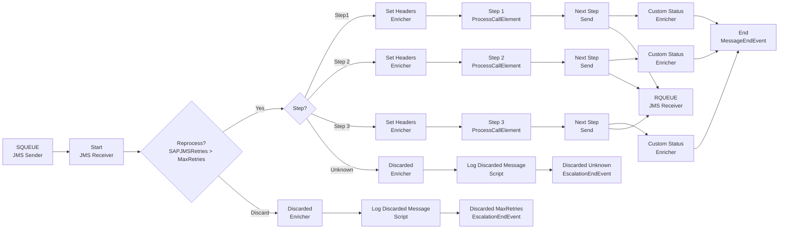

**iFlowId**: SEDA_Model_-_Single_Queue_-_Restart_and_Discard_MMZ - **iFlowVersion**: 1.0.0

**Mermaid Diagram**

**Functional Summary**
- **Brief description of the iFlow**
This iFlow implements a SEDA (Staged Event-Driven Architecture) pattern with a single JMS queue. It receives messages, processes them through multiple steps, and handles exceptions by logging them and discarding messages that exceed the maximum retry count or have an unknown step.

- **Involved systems with Adapters Type and Endpoint Type**
    - SQUEUE: JMS Adapter, EndpointSender
    - Postman: HTTPS Adapter, EndpointSender
    - RQUEUE: JMS Adapter, EndpointRecevier

- **Key steps**
    1.  Receive message via JMS from SQUEUE.
    2.  Determine the current processing step based on the `Step` property.
    3.  Execute the corresponding step (Step 1, Step 2, or Step 3) by calling a local integration process.
    4.  If the step is unknown, discard the message.
    5.  If the message exceeds the maximum retry count, discard the message.
    6.  Log exceptions that occur during processing.
    7.  Send the message to the next step's queue (RQUEUE) via JMS.

- **Message transformation**
    - The iFlow uses Enrichers to set headers (SAP_Sender, SAP_Receiver, SAP_MessageType) and custom statuses (SAP_MessageProcessingLogCustomStatus) at various stages.
    - The "Prepare Step" call activities (e.g., "Prepare Step 2") modify the message body by setting the `Step` property.
    - Groovy scripts are used for logging exceptions and discarded messages.

- **Externalized parameters list and their descriptions**
    - `SEDA_MAIN_QUEUE`: The name of the main JMS queue used for message processing.
    - `Retention Threshold 4 Alerting`: Retention threshold for alerting.
    - `Expiration Period`: Expiration period for messages.
    - `Number of Concurrent Processes`: Number of concurrent processes for the JMS adapter.
    - `Maximum Retry Interval`: Maximum retry interval for the JMS adapter.
    - `Retry Interval`: Retry interval for the JMS adapter.
    - `MaxRetries`: Maximum number of retries before discarding a message.

- **DataStore / JMS Dependency**
Yes

- **Cloud Connector Dependency**
Not Found

- **Common Scripts Dependency**
    - Groovy_Logging_Scripts/Log_Discarded_Message.groovy
    - Groovy_Logging_Scripts/Log_Exception_Async.groovy

- **ProcessDirect ComponentType Dependency**
Not Found