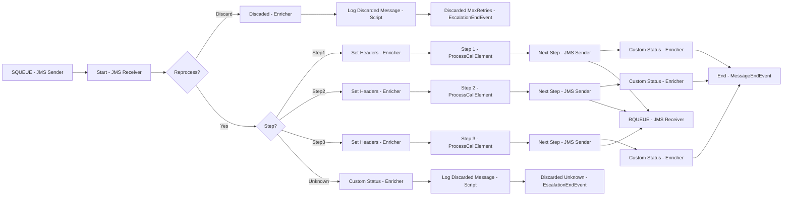

**iFlowId**: SEDA_Model_-_Single_Queue_-_Restart_and_Discard_MMZ - **iFlowVersion**: 1.0.0

**Mermaid Diagram**

**Functional Summary**
- **Brief description of the iFlow**
This iFlow implements a SEDA (Staged Event-Driven Architecture) pattern with a single JMS queue. It receives messages, processes them through a series of steps (Step 1, Step 2, Step 3), and handles exceptions. The iFlow also includes logic to discard messages that exceed a maximum retry count or have an unknown processing step.

- **Involved systems with Adapters Type and Endpoint Type**
    - SQUEUE: JMS (EndpointSender)
    - Postman: HTTPS (EndpointSender)
    - RQUEUE: JMS (EndpointRecevier)

- **Key steps**
 1. Receives a message via JMS from SQUEUE.
 2. Checks if the message has exceeded the maximum retry count. If so, discards the message.
 3. Determines the next processing step based on the `Step` property.
 4. Executes the corresponding step (Step 1, Step 2, or Step 3) by calling a local integration process. Each step prepares a message, potentially throws an exception, and logs custom statuses.
 5. If the step is unknown, the message is discarded.
 6. After each step, the message is sent to RQUEUE via JMS.
 7. Exceptions during processing are caught and logged.

- **Message transformation**
    - The iFlow uses Enrichers to set headers and properties, including `SAP_Sender`, `SAP_Receiver`, `SAP_MessageType`, and `SAP_MessageProcessingLogCustomStatus`.
    - Each step prepares the message by setting the `Step` property to the next step.
    - The content of the message is enriched with static values.

- **Externalized parameters list and their descriptions**
    - `SEDA_MAIN_QUEUE`: The name of the JMS queue used for message processing.
    - `Number of Concurrent Processes`: The number of concurrent processes for the JMS adapter.
    - `Maximum Retry Interval`: The maximum retry interval for the JMS adapter.
    - `Expiration Period`: The expiration period for the JMS adapter.
    - `Retention Threshold 4 Alerting`: The retention threshold for alerting for the JMS adapter.
    - `Retry Interval`: The retry interval for the JMS adapter.
    - `MaxRetries`: The maximum number of retries before discarding a message.

- **DataStore / JMS Dependency**
Yes

- **Cloud Connector Dependency**
Not Found

- **Common Scripts Dependency**
    - Groovy_Logging_Scripts/Log_Discarded_Message.groovy
    - Groovy_Logging_Scripts/Log_Exception_Async.groovy

- **ProcessDirect ComponentType Dependency**
Not Found