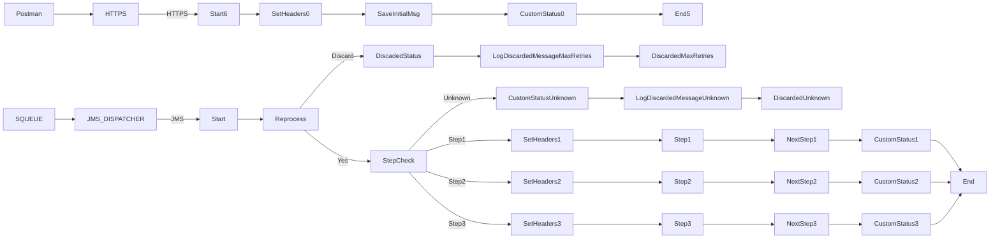

**iFlowId**: SEDA_Model_-_Single_Queue_-_Restart_and_Discard_MMZ - **iFlowVersion**: 1.0.0

**Mermaid Diagram**

**Functional Summary**
- **Brief description of the iFlow**
This iFlow demonstrates a SEDA (Staged Event-Driven Architecture) model using a single JMS queue. It processes messages in multiple steps, with error handling and message discarding mechanisms. The iFlow includes logic to retry failed messages and discard messages that exceed the maximum retry attempts or messages that are routed to a non existing step.

- **Involved systems with Adapters Type and Endpoint Type**
    - SQUEUE (JMS, EndpointSender)
    - Postman (HTTPS, EndpointSender)
    - RQUEUE (JMS, EndpointRecevier)

- **Key steps**
    1.  The iFlow is triggered either by a JMS message from the SQUEUE or by an HTTPS request from Postman.
    2.  The iFlow routes the message based on the `Step` property using an exclusive gateway.
    3.  Each step (Step 1, Step 2, Step 3) involves preparing the message, processing it, and updating the message processing log.
    4.  If an exception occurs during processing, the iFlow logs the exception asynchronously.
    5.  If a message exceeds the maximum retry attempts (`MaxRetries`), or if the message has an unknown step, it is discarded and logged accordingly.

- **Message transformation**
    - The iFlow uses enrichers to set headers (e.g., `SAP_Sender`, `SAP_Receiver`, `SAP_MessageType`) and custom status messages (`SAP_MessageProcessingLogCustomStatus`).
    - Groovy scripts (`Log_Discarded_Message.groovy`, `Log_Exception_Async.groovy`) are used for logging.
    - Message content is modified during Step 1, Step 2 and Step 3.

- **Externalized parameters list and their descriptions**
    - `SEDA_MAIN_QUEUE`: The name of the main JMS queue used for message processing.
    - `Number of Concurrent Processes`: Specifies the number of concurrent processes for the JMS adapter.
    - `Maximum Retry Interval`: The maximum retry interval for the JMS adapter.
    - `Retention Threshold 4 Alerting`: Retention threshold for alerting purposes in the JMS adapter.
    - `Expiration Period`: Expiration period for messages in the JMS adapter.
    - `Retry Interval`: Retry interval for the JMS adapter.
    - `MaxRetries`: The maximum number of retries before a message is discarded.

- **DataStore / JMS Dependency**
Yes

- **Cloud Connector Dependency**
Not Found

- **Common Scripts Dependency**
    - Log_Discarded_Message.groovy, scriptBundleId: Groovy_Logging_Scripts
    - Log_Exception_Async.groovy, scriptBundleId: Groovy_Logging_Scripts

- **ProcessDirect ComponentType Dependency**
Not Found