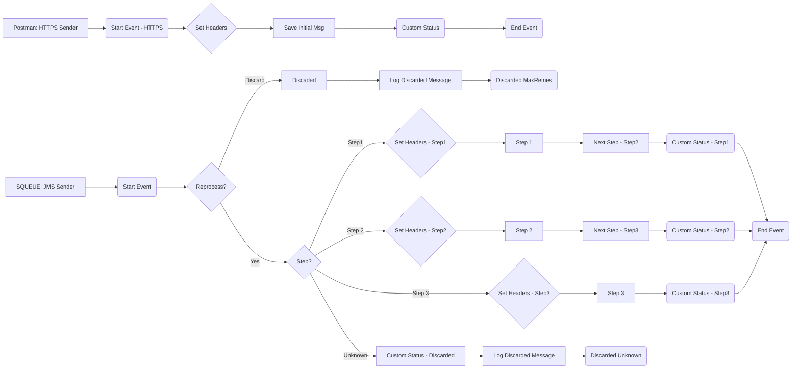

iFlowId: **SEDA_Model_-_Single_Queue_-_Restart_and_Discard_MMZ** - iFlowVersion:**1.0.0**

**Mermaid Diagram**

**Functional Summary**
- **Brief description of the iFlow**
This iFlow implements a SEDA (Staged Event-Driven Architecture) pattern using a single JMS queue. It processes messages in multiple steps, with error handling and message discarding based on retry counts. The iFlow starts either via a JMS message or an HTTPS request, processes the message through several steps, and handles exceptions by logging them and potentially discarding the message if the maximum retry count is exceeded or if the step is unknown.

- **Involved systems with Adapters Type and Endpoint Type**
    - SQUEUE: JMS, EndpointSender
    - Postman: HTTPS, EndpointSender
    - RQUEUE: JMS, EndpointRecevier

- **Key steps**
 1. The iFlow starts either by receiving a JMS message from SQUEUE or an HTTPS request from Postman.
 2. If started via HTTPS, the message is saved to JMS.
 3. The message is then processed through a series of steps (Step 1, Step 2, Step 3), each implemented as a separate integration process.
 4. Each step sets headers and custom statuses.
 5. The iFlow includes error handling for each step, logging exceptions.
 6. The iFlow checks the `SAPJMSRetries` header. If the number of retries exceeds `MaxRetries`, the message is discarded. If the step is unknown, the message is also discarded.

- **Message transformation**
    - The iFlow uses Enrichers to set headers (SAP_Sender, SAP_Receiver, SAP_MessageType) and custom statuses (SAP_MessageProcessingLogCustomStatus).
    - Prepare Step activities (Step 1, Step 2, Step 3) enrich the message with a constant value for the `Step` property and a base64 encoded message.

- **Externalized parameters list and their descriptions**
    - SEDA_MAIN_QUEUE: The name of the JMS queue used for message processing.
    - Number of Concurrent Processes: The number of concurrent processes for the JMS adapter.
    - Maximum Retry Interval: The maximum retry interval for the JMS adapter.
    - Retry Interval: The retry interval for the JMS adapter.
    - Retention Threshold 4 Alerting: Retention threshold for alerting.
    - Expiration Period: Expiration period for messages.
    - MaxRetries: Maximum number of retries before discarding the message.

- **DataStore / JMS Dependency**
Yes

- **Cloud Connector Dependency**
Not Found

- **Common Scripts Dependency**
List of scripts:
    - Log_Discarded_Message.groovy
    - Log_Exception_Async.groovy
    - script1.groovy

- **ProcessDirect ComponentType Dependency**
Not Found