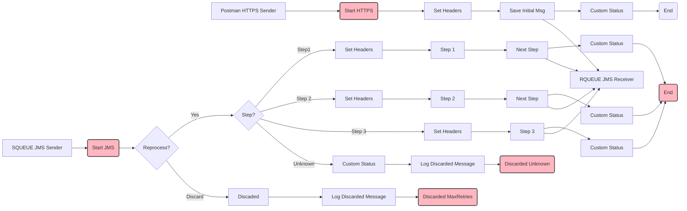

**iFlowId**: SEDA_Model_-_Single_Queue_-_Restart_and_Discard_MMZ - **iFlowVersion**: 1.0.0

**Mermaid Diagram**

**Functional Summary**
-   **Brief description of the iFlow**
    This iFlow demonstrates a SEDA (Staged Event-Driven Architecture) pattern with a single queue. It receives messages, processes them through multiple steps, and handles exceptions. It also includes retry and discard mechanisms for failed messages.

-   **Involved systems with Adapters Type and Endpoint Type**
    -   SQUEUE: JMS Adapter, EndpointSender
    -   RQUEUE: JMS Adapter, EndpointRecevier
    -   Postman: HTTPS Adapter, EndpointSender

-   **Key steps**
    1.  Receive message via JMS adapter from SQUEUE.
    2.  Route the message based on the `Step` property.
    3.  Execute Step 1, Step 2, or Step 3 based on the routing.
    4.  Each step prepares the message for the next step and sets headers.
    5.  If the `Step` property is unknown, discard the message.
    6.  If the message exceeds the maximum retries, discard the message.
    7.  Log exceptions during asynchronous processing.
    8.  Send message via JMS adapter to RQUEUE.

-   **Message transformation**
    -   Each step enriches the message with specific headers and properties to prepare it for the next step.
    -   The content of the message is modified in each step.
    -   Custom statuses are added to the message processing log.

-   **Externalized parameters list and their descriptions**
    -   `SEDA_MAIN_QUEUE`: The name of the JMS queue used for message exchange.
    -   `Number of Concurrent Processes`: The number of concurrent processes for the JMS receiver adapter.
    -   `Maximum Retry Interval`: The maximum retry interval for the JMS receiver adapter.
    -   `Retry Interval`: The retry interval for the JMS receiver adapter.
    -   `Retention Threshold 4 Alerting`: Retention threshold for alerting.
    -   `Expiration Period`: Expiration period for messages.
    -   `MaxRetries`: Maximum number of retries before discarding the message.

-   **DataStore / JMS Dependency**
    Yes

-   **Cloud Connector Dependency**
    Not Found

-   **Common Scripts Dependency**
    -   Groovy\_Logging\_Scripts/Log\_Discarded\_Message.groovy
    -   Groovy\_Logging\_Scripts/Log\_Exception\_Async.groovy

-   **ProcessDirect ComponentType Dependency**
    Not Found