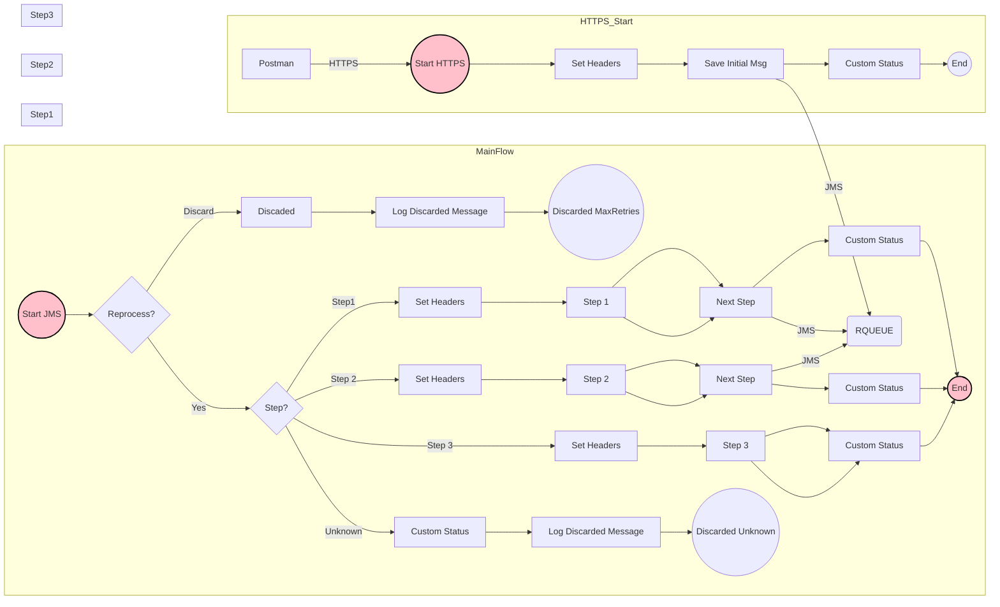

**iFlowId**: SEDA_Model_-_Single_Queue_-_Restart_and_Discard_MMZ - **iFlowVersion**: 1.0.0

**Mermaid Diagram**

**Functional Summary**
-   **Brief description of the iFlow**
    This iFlow demonstrates a SEDA (Staged Event-Driven Architecture) pattern with a single queue, restart, and discard mechanism. It receives messages, processes them through multiple steps (Step 1, Step 2, Step 3), and either sends them to a receiver queue or discards them based on retry attempts. It also includes exception handling and logging.

-   **Involved systems with Adapters Type and Endpoint Type**
    -   SQUEUE: JMS Adapter, EndpointSender
    -   RQUEUE: JMS Adapter, EndpointRecevier
    -   Postman: HTTPS Adapter, EndpointSender

-   **Key steps**
    1.  Receive message from SQUEUE via JMS adapter.
    2.  Route the message based on the `Step` property.
    3.  Process the message through Step 1, Step 2, or Step 3 integration processes.
    4.  Within each step, prepare the message, potentially throw an exception for testing purposes, and log custom statuses.
    5.  If a step is unknown, discard the message.
    6.  If the message exceeds the maximum retry attempts, discard the message.
    7.  Log discarded messages.
    8.  Send the message to RQUEUE via JMS adapter after each step.
    9.  Log Async Exceptions.

-   **Message transformation**
    -   The iFlow uses Enrichers to set headers and properties at various stages.
    -   Groovy scripts are used for logging and potentially for throwing exceptions.
    -   Each step prepares the message by setting the `Step` property.

-   **Externalized parameters list and their descriptions**
    -   `SEDA_MAIN_QUEUE`: Queue name for JMS communication.
    -   `Number of Concurrent Processes`: Number of concurrent processes for the JMS adapter.
    -   `Maximum Retry Interval`: Maximum retry interval for the JMS adapter.
    -   `Retry Interval`: Retry interval for the JMS adapter.
    -   `Retention Threshold 4 Alerting`: Retention threshold for alerting in JMS adapter.
    -   `Expiration Period`: Expiration period for messages in JMS adapter.
    -   `MaxRetries`: Maximum number of retries before discarding the message.

-   **DataStore / JMS Dependency**
    Yes

-   **Cloud Connector Dependency**
    Not Found

-   **Common Scripts Dependency**
    -   Groovy_Logging_Scripts/Log_Discarded_Message.groovy
    -   Groovy_Logging_Scripts/Log_Exception_Async.groovy

-   **ProcessDirect ComponentType Dependency**
    Not Found