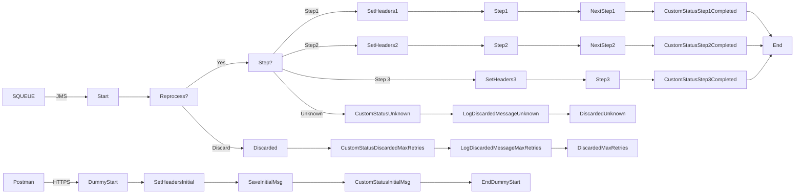

**iFlowId**: SEDA_Model_-_Single_Queue_-_Restart_and_Discard_MMZ - **iFlowVersion**: 1.0.1

**Mermaid Diagram**

**BPMN Diagram**

**Functional Summary**
- **Brief description of the iFlow**
This iFlow demonstrates a SEDA (Staged Event-Driven Architecture) model with a single queue. It receives messages, processes them through multiple steps, and handles exceptions. It includes retry and discard mechanisms based on the number of retries.

- **Involved systems with Adapters Type and Endpoint Type**
    - SQUEUE: JMS (EndpointSender)
    - Postman: HTTPS (EndpointSender)
    - RQUEUE: JMS (EndpointRecevier)

- **Key steps**
    1. Receive message via HTTPS or JMS.
    2. Set initial headers.
    3. Save the initial message for async processing via JMS.
    4. Route the message based on the `Step` property (Step1, Step2, Step3, Unknown).
    5. Each Step process calls an Integration Process (Step 1, Step 2, Step 3)
    6. If a step fails, an exception subprocess is triggered to log the error.
    7. If the number of retries exceeds the maximum, the message is discarded after logging.

- **Message transformation**
    - The iFlow utilizes Enrichers with Constant values to manipulate Header and Body properties.

- **Externalized parameters list, configured values and their descriptions**
    - MaxRetries: 10 (Maximum number of retries before discarding the message)
    - SEDA_MAIN_QUEUE: SEDA_MODEL_MMZ (The main JMS queue name)
    - Expiration Period: 7 (Expiration period for JMS messages)
    - Maximum Retry Interval: 1440 (Maximum retry interval in minutes)
    - Retention Threshold 4 Alerting: 1 (Retention threshold for alerting)
    - Retry Interval: 15 (Retry interval in minutes)
    - Number of Concurrent Processes: 1 (Number of concurrent processes for the JMS adapter)

- **DataStore / JMS Dependency**
Yes

- **Cloud Connector Dependency**
Not Found

- **Common Scripts Dependency**
    - Log_Discarded_Message.groovy, scriptBundleId: Groovy_Logging_Scripts
    - Log_Exception_Async.groovy, scriptBundleId: Groovy_Logging_Scripts

- **ProcessDirect ComponentType Dependency**
Not Found