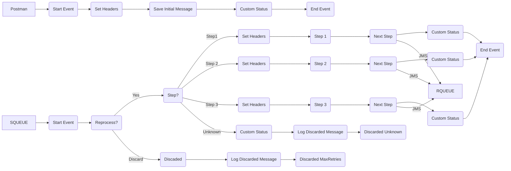

markdown
**iFlowId**: SEDA_Model_-_Single_Queue_-_Restart_and_Discard_MMZ - **iFlowVersion**: 1.0.1

**Mermaid Diagram**

**BPMN Diagram**

**Functional Summary**
- **Brief description of the iFlow**
This iFlow implements a SEDA (Staged Event-Driven Architecture) pattern with a single queue, restart, and discard mechanism. It receives messages via HTTPS, processes them in multiple steps (Step1, Step2, Step3), and sends them to a JMS queue for asynchronous processing. It handles exceptions at each step and logs discarded messages.

- **Involved systems with Adapters Type and Endpoint Type**
    - Postman - HTTPS - EndpointSender
    - SQUEUE - JMS - EndpointSender
    - RQUEUE - JMS - EndpointRecevier

- **Key steps**
    1. Receive message via HTTPS (from Postman).
    2. Save initial message and set headers for step 1.
    3. Route the message through steps 1, 2, and 3 which each prepare a message using an enricher and set step specific custom status.
    4. Send the processed message to JMS queue "SEDA_MAIN_QUEUE" (RQUEUE).
    5. If a step fails, log the exception and set a custom status in the message processing log.
    6. If the message has been reprocessed more than the defined maximum retries, discard the message and log the discard event.
    7. Route each step into the SEDA router and apply custom status as complete.

- **Message transformation**
    - The iFlow employs Enrichers to set headers and properties at each step. These Enrichers modify the message content with static values and expressions.
    - Groovy scripts are used in the exception handling to log details about the exception in the Message Processing Log.
    - Each step has an enricher to set the $name=Step property and creates a step number

- **Externalized parameters list, configured values and their descriptions**
    - SEDA_MAIN_QUEUE = SEDA_MODEL_MMZ: Name of the main JMS queue.
    - Number of Concurrent Processes = 1: Number of concurrent processes for the JMS receiver adapter.
    - MaxRetries = 10: Maximum number of retries for message processing.
    - Retry Interval = 15: Interval in minutes between message processing retries.
    - Maximum Retry Interval = 1440: Maximum interval in minutes between message processing retries.
    - Expiration Period = 7: Expiration period for messages in days.
    - Retention Threshold 4 Alerting = 1: Retention threshold for alerting in days.

- **DataStore / JMS Dependency**
Yes

- **Cloud Connector Dependency**
Not Found

- **Common Scripts Dependency**
    - Groovy_Logging_Scripts: Log_Discarded_Message.groovy
    - Groovy_Logging_Scripts: Log_Exception_Async.groovy

- **ProcessDirect ComponentType Dependency**
Not Found