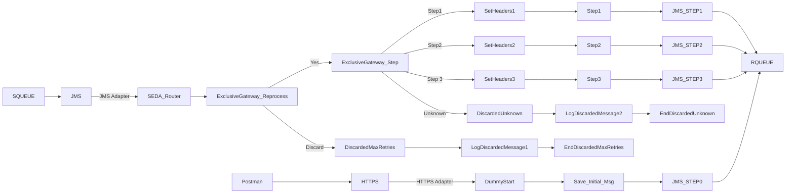

markdown
**iFlowId**: SEDA_Model_-_Single_Queue_-_Restart_and_Discard_MMZ - **iFlowVersion**: 1.0.1

**Mermaid Diagram**

**BPMN Diagram**

**Functional Summary**
- **Brief description of the iFlow**
This iFlow implements a SEDA (Staged Event-Driven Architecture) model with a single queue for asynchronous message processing. It includes retry mechanisms and discard options based on maximum retries exceeded or unknown processing steps.

- **Involved systems with Adapters Type and Endpoint Type**
    - SQUEUE - JMS - EndpointSender
    - Postman - HTTPS - EndpointSender
    - RQUEUE - JMS - EndpointRecevier

- **Key steps**
    1. Receives message via HTTPS (Postman) and saves the message in a queue.
    2. SEDA Router receives message from JMS Queue (SQUEUE).
    3. SEDA Router decides which step to execute based on the `Step` property.
    4. Executes Step 1, Step 2 or Step 3 locally.
    5. Each Step Enriches and prepare a message and log the execution.
    6. Sends the message back to the JMS Queue (RQUEUE).
    7. If `MaxRetries` exceeded the message will be discarded with logging.

- **Message transformation**
    - Enricher components are used to set headers and properties.
    - Groovy scripts can be used for logging, prepare, set and test errors to simulate exceptions.

- **Externalized parameters list, configured values and their descriptions**
    - `MaxRetries`: 10 - Maximum number of retries before discarding the message.
    - `SEDA_MAIN_QUEUE`: SEDA_MODEL_MMZ - The name of the main JMS queue used for the SEDA model.
    - `Expiration Period`: 7 - Message Expiration Period.
    - `Maximum Retry Interval`: 1440 - Maximum Retry Interval
    - `Retention Threshold 4 Alerting`: 1 - Retention Threshold for Alerting
    - `Retry Interval`: 15 - Retry Interval
    - `Number of Concurrent Processes`: 1 - Number of Concurrent Processes

- **DataStore / JMS Dependency**
Yes

- **Cloud Connector Dependency**
Not Found

- **Common Scripts Dependency**
    - Groovy_Logging_Scripts: Log_Discarded_Message.groovy
    - Groovy_Logging_Scripts: Log_Exception_Async.groovy

- **ProcessDirect ComponentType Dependency**
Not Found