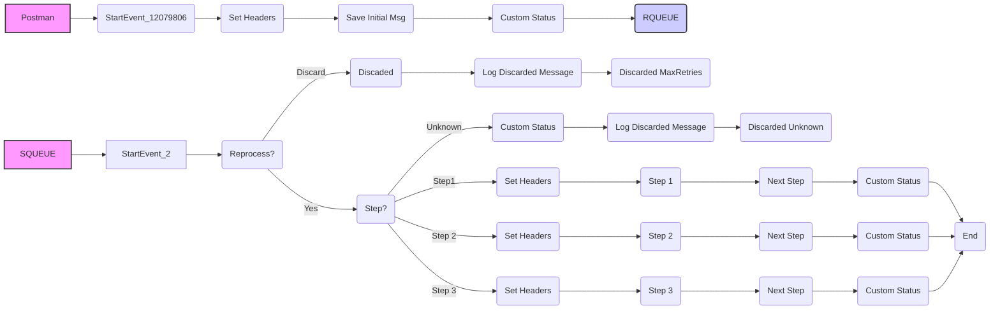

**iFlowId**: SEDA_Model_-_Single_Queue_-_Restart_and_Discard_MMZ - **iFlowVersion**: 1.0.1

**Mermaid Diagram**

**BPMN Diagram**

**Functional Summary**
- **Brief description of the iFlow**
This iFlow implements a SEDA (Staged Event-Driven Architecture) model with a single queue. It receives messages via HTTPS, enriches them, and then dispatches them to a JMS queue for asynchronous processing. The iFlow includes retry mechanisms and discarding of messages that exceed the maximum retry attempts or are routed to an unknown step.

- **Involved systems with Adapters Type and Endpoint Type**
    - Postman - HTTPS - EndpointSender
    - SQUEUE - JMS - EndpointSender
    - RQUEUE - JMS - EndpointRecevier

- **Key steps**
    1. Receive messages via HTTPS adapter.
    2. Enrich message headers and save initial message for asynchronous processing.
    3. Route the message through different steps (Step1, Step2, Step3) based on the 'Step' property.
    4. If a step is unknown, the message is discarded.
    5. After each step, the message is sent to a JMS queue for further processing.
    6. The iFlow handles exceptions in each step, logging them for asynchronous handling.
    7. Messages exceeding the maximum retries are discarded.

- **Message transformation**
    - Enricher: Used to set headers (SAP_Sender, SAP_Receiver, SAP_MessageType) and custom statuses (SAP_MessageProcessingLogCustomStatus) at various stages of the flow.
    - Enricher: Used to Prepare Step 2 and Step 3 messages.
    - Groovy Script: Used to log discarded messages and exceptions.

- **Externalized parameters list, configured values and their descriptions**
    - SEDA_MAIN_QUEUE=SEDA_MODEL_MMZ: The name of the main JMS queue used for message processing.
    - Number of Concurrent Processes=1: The number of concurrent processes for the JMS receiver adapter.
    - MaxRetries=10: Maximum number of retries before a message is discarded.
    - Retry Interval=15: Interval (in minutes) between retry attempts.
    - Maximum Retry Interval=1440: Maximum retry interval (in minutes).
    - Expiration Period=7: Message Expiration Period.
    - Retention Threshold 4 Alerting=1: Message Retention Threshold.

- **DataStore / JMS Dependency**
Yes

- **Cloud Connector Dependency**
Not Found

- **Common Scripts Dependency**
    - Log_Discarded_Message.groovy - scriptBundleId: Groovy_Logging_Scripts
    - Log_Exception_Async.groovy - scriptBundleId: Groovy_Logging_Scripts

- **ProcessDirect ComponentType Dependency**
Not Found