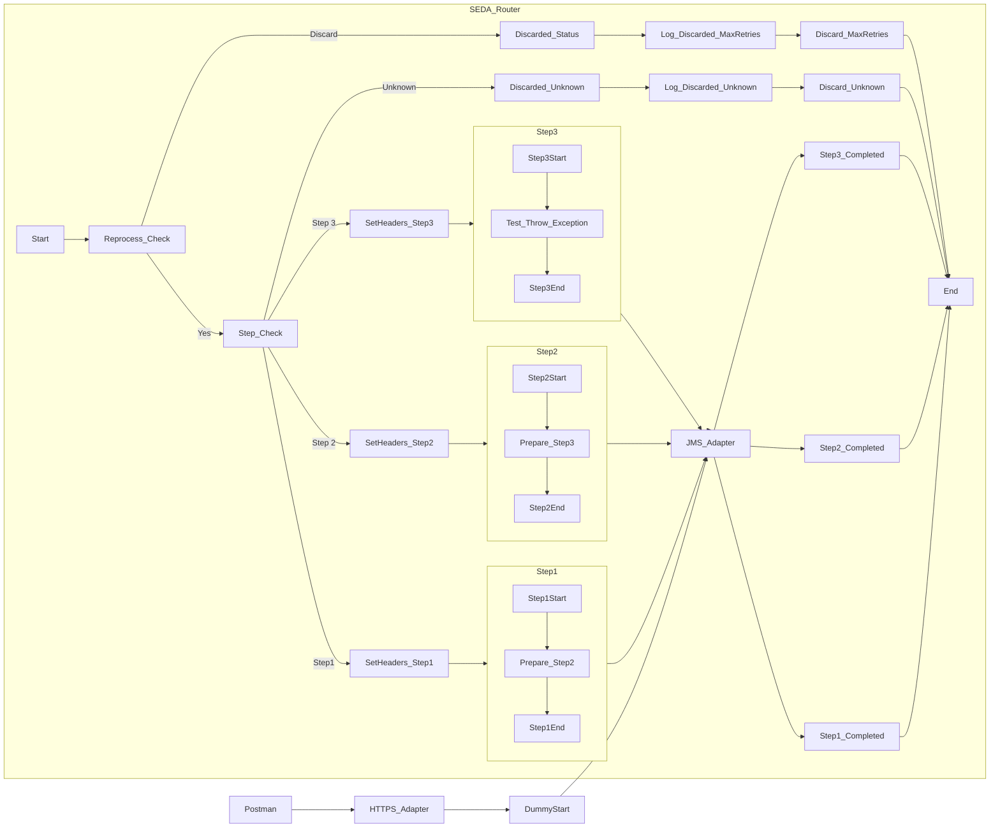

**iFlowId**: SEDA_Model_-_Single_Queue_-_Restart_and_Discard_MMZ - **iFlowVersion**: 1.0.1

**Mermaid Diagram**

**BPMN Diagram**

**Functional Summary**
- **Brief description of the iFlow**
  This iFlow simulates a multi-step asynchronous process using JMS queues and SEDA (Staged Event-Driven Architecture) for routing. It includes error handling with exception subprocesses and message discarding based on retry counts. The process is triggered by an HTTPS call, and messages are passed through different steps.

- **Involved systems with Adapters Type and Endpoint Type**
    - SQUEUE: JMS (EndpointSender)
    - Postman: HTTPS (EndpointSender)
    - RQUEUE: JMS (EndpointRecevier)

- **Key steps**
    1.  Receive a message via HTTPS.
    2.  Save the initial message and set headers.
    3.  The "SEDA Router" process determines which step to execute based on the `Step` property.
    4.  Each step (Step 1, Step 2, Step 3) prepares a message and then calls a subsequent process.
    5.  After each step custom statuses are set and the next queue "Next Step" is defined through a Service Task.
    6.  If a step fails, an exception subprocess logs the error.
    7.  If the message exceeds the maximum retry count, it's discarded. Otherwise it continues in the SEDA Router.
    8.  A script logs discarded messages.

- **Message transformation**
    - Enricher components are used to set headers and properties at various stages.
    - Constant values and expressions are used to manipulate message content.
    - Scripts are used to log exception and discarded messages.

- **Externalized parameters list, configured values and their descriptions**
    - `MaxRetries`: 10 (Maximum number of retries before discarding a message)
    - `SEDA_MAIN_QUEUE`: SEDA_MODEL_MMZ (Main queue used for SEDA routing)
    - `Expiration Period`: 7 (Expiration period for messages)
    - `Maximum Retry Interval`: 1440 (Maximum retry interval in minutes)
    - `Retention Threshold 4 Alerting`: 1 (Retention threshold for alerting)
    - `Retry Interval`: 15 (Retry interval in minutes)
    - `Number of Concurrent Processes`: 1 (Number of concurrent processes for JMS)

- **DataStore / JMS Dependency**
    Yes

- **Cloud Connector Dependency**
    Not Found

- **Common Scripts Dependency**
    - `Log_Exception_Async.groovy` (scriptBundleId: Groovy_Logging_Scripts)
    - `Log_Discarded_Message.groovy` (scriptBundleId: Groovy_Logging_Scripts)

- **ProcessDirect ComponentType Dependency**
    Not Found