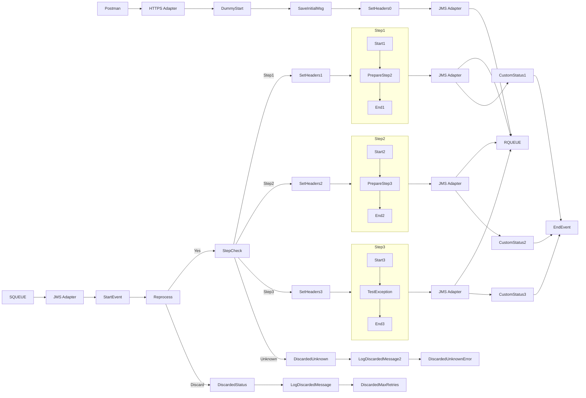

markdown
**iFlowId**: SEDA_Model_-_Single_Queue_-_Restart_and_Discard_MMZ - **iFlowVersion**: 1.0.1

**Mermaid Diagram**

**BPMN Diagram**

**Functional Summary**
-   **Brief description of the iFlow**
    This iFlow implements a SEDA (Staged Event-Driven Architecture) pattern with a single queue. It receives a message, processes it through several steps (Step 1, Step 2, Step 3), and then either sends it to the next step or discards it based on the number of retries. It includes exception handling and logging.

-   **Involved systems with Adapters Type and Endpoint Type**
    -   SQUEUE: JMS (EndpointSender)
    -   Postman: HTTPS (EndpointSender)
    -   RQUEUE: JMS (EndpointRecevier)

-   **Key steps**

    1.  Receive message via HTTPS from Postman.
    2.  Save Initial message
    3.  Set Headers with sender, receiver and messagetype info
    4.  Determine if message needs to be reprocessed or discarded.
    5.  Route the message to Step 1, Step 2 or Step 3 based on the "Step" property.
    6.  Each step executes and prepares the message for the next step
    7.  If message reaches the max number of retries, discard it with an error.
    8.  If the "Step" property is not found, discard it with an error.
    9.  Custom statuses enriched at different stages

-   **Message transformation**
    -   Prepare Step 2/3: Enricher steps that set the "Step" property to "Step2" or "Step3" respectively and also add a message to the body to be processed in the next step.
    -   Set Headers: Enricher steps that sets the header SAP_Sender, SAP_Receiver, SAP_MessageType with the "Step" property and constant values

-   **Externalized parameters list, configured values and their descriptions**
    -   `MaxRetries`: 10 - Maximum number of retries before discarding the message.
    -   `SEDA_MAIN_QUEUE`: SEDA_MODEL_MMZ - Name of the JMS queue used for message exchange.
    -   `Expiration Period`: 7 - Expiration period for messages in days.
    -   `Maximum Retry Interval`: 1440 - Maximum retry interval in minutes.
    -   `Retention Threshold 4 Alerting`: 1 - Retention threshold for alerting.
    -   `Retry Interval`: 15 - Retry interval in minutes.
    -   `Number of Concurrent Processes`: 1 - Number of concurrent processes.

-   **DataStore / JMS Dependency**
    Yes

-   **Cloud Connector Dependency**
    Not Found

-   **Common Scripts Dependency**
    -   Log_Discarded_Message.groovy, scriptBundleId: Groovy_Logging_Scripts
    -   Log_Exception_Async.groovy, scriptBundleId: Groovy_Logging_Scripts

-   **ProcessDirect ComponentType Dependency**
    Not Found