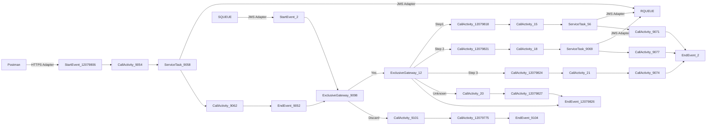

**iFlowId**: SEDA_Model_-_Single_Queue_-_Restart_and_Discard_MMZ - **iFlowVersion**: 1.0.1

**Mermaid Diagram**

**BPMN Diagram**

**Functional Summary**
- **Brief description of the iFlow**
The iFlow processes messages asynchronously via a single JMS queue (SEDA_MAIN_QUEUE). It includes logic to retry failed messages up to a maximum number of retries (MaxRetries). Messages exceeding the retry limit or encountering unknown steps are discarded. The iFlow consists of multiple steps (Step 1, Step 2, Step 3) each implemented as a separate integration process.

- **Involved systems with Adapters Type and Endpoint Type**
    - SQUEUE: JMS Adapter (EndpointSender)
    - RQUEUE: JMS Adapter (EndpointRecevier)
    - Postman: HTTPS Adapter (EndpointSender)

- **Key steps**
    1. Receive message via JMS adapter from SQUEUE to SEDA_MAIN_QUEUE.
    2. Determine if the message should be reprocessed based on retry attempts (SAPJMSRetries header). If the number of retries exceeds MaxRetries, the message is discarded.
    3. Based on the 'Step' property in the message content, route to 'Step 1', 'Step 2', or 'Step 3' integration process.
    4. Each step performs some logic and sets a custom status on the message processing log.
    5. The message is then sent to the next step via the SEDA_MAIN_QUEUE using the JMS adapter, until the step is equal to 'EndMessage'.
    6. If an exception occurs within a step, a custom status is set and the exception is logged asynchronously via Groovy script. Discarded messages are also logged via Groovy script.
    7. Postman can trigger the iFlow via HTTPS, sending a message to the SEDA_MAIN_QUEUE.

- **Message transformation**
    - Each "Step" integration process sets/deletes properties in the message body and headers to prepare the message for the subsequent step.
    - The Enricher component is used to set custom status values in the message processing log.
    - Groovy scripts are used to log exceptions and discarded messages.

- **Externalized parameters list, configured values and their descriptions**
    - SEDA_MAIN_QUEUE: SEDA_MODEL_MMZ - Name of the main JMS queue used for asynchronous processing.
    - MaxRetries: 10 - Maximum number of retry attempts for a message.
    - Expiration Period: 7 - Message Expiration Period (unspecified units)
    - Maximum Retry Interval: 1440 - Maximum time (unspecified units) to retry sending messages.
    - Retention Threshold 4 Alerting: 1 - Retention Threshold (unspecified units) for alerting purposes.
    - Retry Interval: 15 - Interval (unspecified units) between retry attempts.
    - Number of Concurrent Processes: 1 - Number of concurrent processes

- **DataStore / JMS Dependency**
Yes

- **Cloud Connector Dependency**
Not Found

- **Common Scripts Dependency**
    - Log_Discarded_Message.groovy - Groovy_Logging_Scripts
    - Log_Exception_Async.groovy - Groovy_Logging_Scripts

- **ProcessDirect ComponentType Dependency**
Not Found