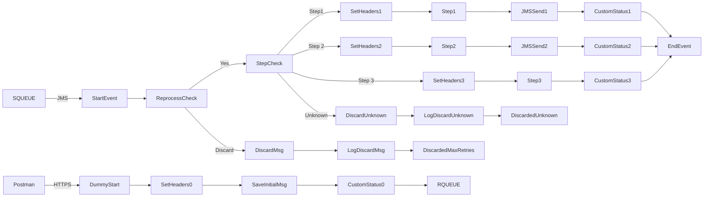

markdown
**iFlowId**: SEDA_Model_-_Single_Queue_-_Restart_and_Discard_MMZ - **iFlowVersion**: 1.0.1

**Mermaid Diagram**

**BPMN Diagram**

**Functional Summary**
- **Brief description of the iFlow**
The iFlow implements a SEDA (Staged Event-Driven Architecture) model with a single queue. It receives messages, processes them in a sequence of steps, and handles potential errors by logging exceptions and discarding messages that exceed the maximum retry count. It allows for restarting and discarding messages in a managed manner.

- **Involved systems with Adapters Type and Endpoint Type**
    - SQUEUE: JMS (EndpointSender)
    - Postman: HTTPS (EndpointSender)
    - RQUEUE: JMS (EndpointRecevier)

- **Key steps**
1.  Receive message from HTTPS via Postman.
2.  Save initial message.
3.  Set headers for initial step (Step1).
4.  Route message based on the 'Step' property.
5.  Perform Step 1, Step 2, or Step 3 (each step prepare the body for the next step by setting the property Step with the new value).
6.  Send message to JMS queue for the next step.
7.  If an exception occurs in any step, log the exception.
8.  If the maximum retry count is exceeded, discard the message and log the event.
9.  Route message based on `Step` property.

- **Message transformation**
    - Enricher components are used in "Step 2" and "Step 1" processes to set headers and properties, and prepare message bodies.
    - Groovy scripts "Log_Exception_Async.groovy" and "Log_Discarded_Message.groovy" are used in various error handling subprocesses.

- **Externalized parameters list, configured values and their descriptions**
    - MaxRetries: 10 - Maximum number of retries before discarding a message.
    - SEDA_MAIN_QUEUE: SEDA_MODEL_MMZ - Name of the main JMS queue used for message processing.
    - Expiration Period: 7 - Expiration period of the JMS messages.
    - Maximum Retry Interval: 1440 - Maximum interval between retries, in minutes.
    - Retention Threshold 4 Alerting: 1 - Retention threshold for alerting purposes.
    - Retry Interval: 15 - Interval between retries, in minutes.
    - Number of Concurrent Processes: 1 - Number of concurrent processes for the JMS adapter.

- **DataStore / JMS Dependency**
Yes

- **Cloud Connector Dependency**
Not Found

- **Common Scripts Dependency**
    - Groovy_Logging_Scripts: Log_Discarded_Message.groovy
    - Groovy_Logging_Scripts: Log_Exception_Async.groovy

- **ProcessDirect ComponentType Dependency**
Not Found