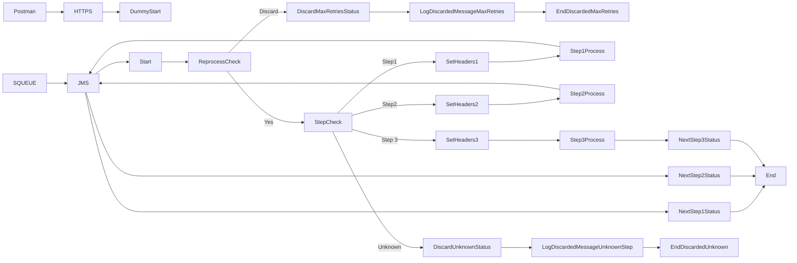

markdown
**iFlowId**: SEDA_Model_-_Single_Queue_-_Restart_and_Discard_MMZ - **iFlowVersion**: 1.0.1

**Mermaid Diagram**

**BPMN Diagram**

**Functional Summary**
- **Brief description of the iFlow**
This iFlow demonstrates a SEDA (Staged Event-Driven Architecture) model with a single queue. It receives messages, processes them in multiple steps, and handles exceptions by logging them. It also includes retry logic and discards messages exceeding the maximum retry limit or encountering unknown routing steps.

- **Involved systems with Adapters Type and Endpoint Type**
    - SQUEUE - JMS - EndpointSender
    - Postman - HTTPS - EndpointSender
    - RQUEUE - JMS - EndpointReceiver

- **Key steps**
    1. Receive message via JMS adapter from SQUEUE.
    2. Determine the processing step based on message content.
    3. Execute the corresponding step (Step 1, Step 2, or Step 3) via local integration processes.
    4. If the message is reprocessed, check if the maximum retries have been exceeded. If yes, discard the message.
    5. Log message discarded in case of Max Retries Reached or Unknown Step
    6. Send the message to the next queue (RQUEUE) after each step via JMS Adapter.

- **Message transformation**
    - The iFlow uses Enrichers to set message headers (e.g., SAP_Sender, SAP_Receiver, SAP_MessageType) and custom statuses in each step, which is a kind of content enrichment.
    - Content modifiers are used to prepare content for next steps.

- **Externalized parameters list, configured values and their descriptions**
    - `MaxRetries`: 10 - Maximum number of retries before discarding a message.
    - `SEDA_MAIN_QUEUE`: SEDA_MODEL_MMZ - Name of the main JMS queue.
    - `Expiration Period`: 7 - Expiration period for messages (likely in days, but unit not specified).
    - `Maximum Retry Interval`: 1440 - Maximum interval between retries (likely in minutes, but unit not specified).
    - `Retention Threshold 4 Alerting`: 1 - Retention threshold for alerting purposes (unit not specified).
    - `Retry Interval`: 15 - Interval between retries (likely in minutes, but unit not specified).
    - `Number of Concurrent Processes`: 1 - Number of concurrent processes for the JMS receiver adapter.

- **DataStore / JMS Dependency**
Yes

- **Cloud Connector Dependency**
Not Found

- **Common Scripts Dependency**
    - Groovy_Logging_Scripts - Log_Discarded_Message.groovy
    - Groovy_Logging_Scripts - Log_Exception_Async.groovy

- **ProcessDirect ComponentType Dependency**
Not Found