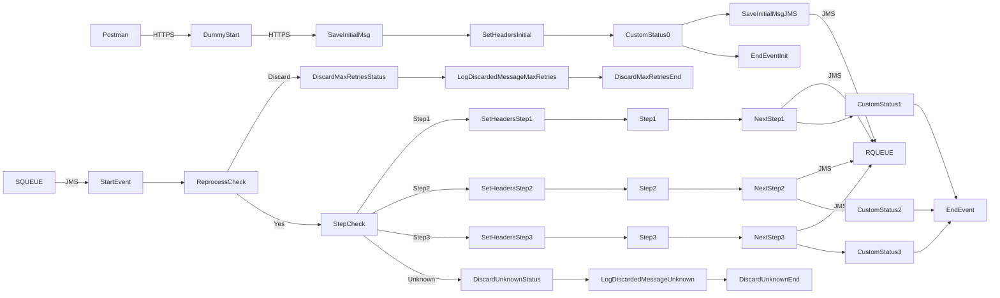

**iFlowId**: SEDA_Model_-_Single_Queue_-_Restart_and_Discard_MMZ - **iFlowVersion**: 1.0.1

**Mermaid Diagram**

**BPMN Diagram**

**Functional Summary**
- **Brief description of the iFlow**
The iFlow implements a SEDA (Staged Event-Driven Architecture) pattern with a single queue. It receives messages, processes them through multiple steps (Step1, Step2, Step3), and handles exceptions. It includes retry logic and a discard mechanism for messages that exceed the maximum retry attempts or encounter unknown routing.

- **Involved systems with Adapters Type and Endpoint Type**
    - SQUEUE: JMS - EndpointSender
    - Postman: HTTPS - EndpointSender
    - RQUEUE: JMS - EndpointRecevier

- **Key steps**
    1. Receive message via JMS adapter.
    2. Determine processing step based on message content or headers.
    3. Execute corresponding processing step (Step1, Step2, or Step3).
    4. If a step completes successfully, set headers for the next step and send the message to the same JMS queue.
    5. If a step fails, log the exception.
    6. If the message exceeds the maximum retry attempts, discard the message and log it.
    7. If no route found and step cannot be resolved, discard the message and log it.

- **Message transformation**
    - Enricher: Used to create/delete/update message headers and properties. Example: Adding `SAP_Sender`, `SAP_Receiver`, `SAP_MessageType` headers
    - Enricher: Used to enrich message body, example to include hardcoded Step2Message

- **Externalized parameters list, configured values and their descriptions**
    - `MaxRetries`: 10 - Maximum number of retries for a message before discarding.
    - `SEDA_MAIN_QUEUE`: SEDA_MODEL_MMZ - Name of the main JMS queue used for the SEDA flow.
    - `Expiration Period`: 7 - Expiration period (units not specified).
    - `Maximum Retry Interval`: 1440 - Maximum interval between retries (units not specified).
    - `Retention Threshold 4 Alerting`: 1 - Threshold for retention alerting (units not specified).
    - `Retry Interval`: 15 - Interval between retry attempts (units not specified).
    - `Number of Concurrent Processes`: 1 - Number of concurrent processes for the JMS receiver adapter.

- **DataStore / JMS Dependency**
Yes

- **Cloud Connector Dependency**
Not Found

- **Common Scripts Dependency**
    - Log_Exception_Async.groovy - Groovy_Logging_Scripts
    - Log_Discarded_Message.groovy - Groovy_Logging_Scripts

- **ProcessDirect ComponentType Dependency**
Not Found