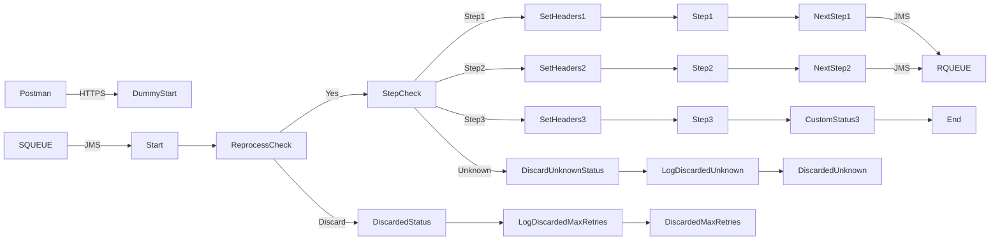

**iFlowId**: SEDA_Model_-_Single_Queue_-_Restart_and_Discard_MMZ - **iFlowVersion**: 1.0.1

**Mermaid Diagram**

**Functional Summary**
-   **Brief description of the iFlow**
    This iFlow implements a SEDA (Staged Event-Driven Architecture) model using a single JMS queue. It receives messages, processes them through several steps, and either sends the processed message to a final destination or discards it based on the number of retries or an unknown step.

-   **Involved systems with Adapters Type and Endpoint Type**
    -   SQUEUE: JMS (EndpointSender)
    -   Postman: HTTPS (EndpointSender)
    -   RQUEUE: JMS (EndpointRecevier)

-   **Key steps**
    1.  Receives message via JMS or HTTPS.
    2.  Checks if the message should be reprocessed or discarded (based on `SAPJMSRetries` header compared to the `MaxRetries` parameter).
    3.  Routes the message to different processing steps (Step1, Step2, Step3) based on the `Step` property.
    4.  Within each Step, a local integration process enriches message and logs status.
    5.  Sends the message to the next step via JMS.
    6.  If the `Step` property is unknown, the message is discarded.

-   **Message transformation**
    -   The iFlow uses enrichers to set headers and properties, including `SAP_Sender`, `SAP_Receiver`, `SAP_MessageType`, and `SAP_MessageProcessingLogCustomStatus`.
    -   Step processes use content modifiers to add or delete properties

-   **Externalized parameters list, configured values and their descriptions**
    -   MaxRetries: 10 - The maximum number of retries before discarding a message.
    -   SEDA_MAIN_QUEUE: SEDA_MODEL_MMZ - The name of the main JMS queue.
    -   Expiration Period: 7 - The expiration period of the JMS message.
    -   Maximum Retry Interval: 1440 - The maximum retry interval for JMS.
    -   Retention Threshold 4 Alerting: 1 - The retention threshold for alerting.
    -   Retry Interval: 15 - The retry interval for JMS.
    -   Number of Concurrent Processes: 1 - Number of concurrent process instances for JMS adapter.

-   **DataStore / JMS Dependency**
    Yes

-   **Cloud Connector Dependency**
    Not Found

-   **Common Scripts Dependency**
    -   Groovy_Logging_Scripts: Log_Discarded_Message.groovy
    -   Groovy_Logging_Scripts: Log_Exception_Async.groovy

-   **ProcessDirect ComponentType Dependency**
    Not Found