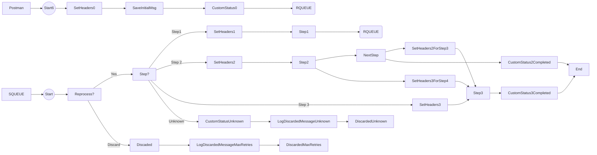

**iFlowId**: SEDA_Model_-_Single_Queue_-_Restart_and_Discard_MMZ - **iFlowVersion**: 1.0.1

**Mermaid Diagram**

**BPMN Diagram**

**Functional Summary**
- **Brief description of the iFlow**
This iFlow demonstrates a SEDA (Staged Event-Driven Architecture) model with a single queue. It receives messages, processes them in multiple steps, and discards messages that exceed the maximum retry attempts or have an unknown step.

- **Involved systems with Adapters Type and Endpoint Type**
    - SQUEUE: JMS - EndpointSender
    - Postman: HTTPS - EndpointSender
    - RQUEUE: JMS - EndpointRecevier

- **Key steps**
    1. The iFlow starts upon receiving a message from the SEDA_MAIN_QUEUE via the JMS adapter or via HTTPS adapter and URL path '/seda/start/jms'.
    2. The message is processed by the "Dummy Start" process which enrich the message to start the route.
    3. The iFlow determines the next step based on the `Step` property.
    4.  It calls the corresponding sub-process ("Step 1", "Step 2", or "Step 3").
    5.  Each step updates the message and forwards it.
    6. If the step is unknown, the message is discarded with "DiscardedUnknownStep" status.
    7.  If the maximum retry count is exceeded, the message is discarded with "DiscardedMaxRetries" status.
    8. Exception subprocesses are used in each step to set custom statuses and log async exceptions using Groovy scripts.

- **Message transformation**
    - The "Dummy Start" process sets headers such as `SAP_Sender`, `SAP_Receiver`, and `SAP_MessageType`. It also sets the property `Step` to "Step1".
    - "Step 1", "Step 2", and "Step 3" processes update the `Step` property to determine the next step. The processes "Prepare Step 2" and "Prepare Step 3" enriches the content by adding `<Envelope><MessageB64>...</MessageB64></Envelope>`.
    - Custom statuses are added to the message processing log throughout the flow.

- **Externalized parameters list, configured values and their descriptions**
    - `MaxRetries`: 10 - Maximum number of retries before discarding a message.
    - `SEDA_MAIN_QUEUE`: SEDA_MODEL_MMZ - Name of the main queue used for message processing.
    - `Expiration Period`: 7 - Expiration period for messages.
    - `Maximum Retry Interval`: 1440 - Maximum retry interval.
    - `Retention Threshold 4 Alerting`: 1 - Retention threshold for alerting.
    - `Retry Interval`: 15 - Retry interval.
    - `Number of Concurrent Processes`: 1 - Number of concurrent processes.

- **DataStore / JMS Dependency**
Yes

- **Cloud Connector Dependency**
Not Found

- **Common Scripts Dependency**
    - Log_Discarded_Message.groovy - Groovy_Logging_Scripts
    - Log_Exception_Async.groovy - Groovy_Logging_Scripts

- **ProcessDirect ComponentType Dependency**
Not Found