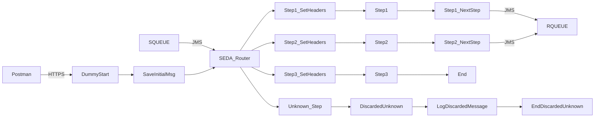

**iFlowId**: SEDA_Model_-_Single_Queue_-_Restart_and_Discard_MMZ - **iFlowVersion**: 1.0.1

**Mermaid Diagram**

**BPMN Diagram**

**Functional Summary**
- **Brief description of the iFlow**
This iFlow demonstrates a SEDA (Staged Event-Driven Architecture) model using a single JMS queue with restart and discard capabilities. It receives a message, processes it through multiple steps, and either sends it to a receiver queue or discards it based on the number of retries.

- **Involved systems with Adapters Type and Endpoint Type**
    - SQUEUE - JMS - EndpointSender
    - Postman - HTTPS - EndpointSender
    - RQUEUE - JMS - EndpointRecevier

- **Key steps**
    1. Receive message via HTTPS from Postman or JMS from SQUEUE.
    2. Set initial headers in "Dummy Start" process.
    3. Save the initial message to RQUEUE via JMS.
    4. Route message through steps 1, 2, and 3 based on the "Step" property in "SEDA Router" process.
    5. In each step, the iFlow sets message headers and sends the message to the next step (processes 'Step 1', 'Step 2', 'Step 3').
    6. If a step encounters an exception, it logs the exception and ends.
    7. After each step is completed custom statuses are saved to the message processing log.
    8. If the maximum number of retries is reached, the message is discarded and logged.
    9. Log discarded messages.

- **Message transformation**
    - In Step 2 and Step 1 a property "Step" is set to identify the current step.
    - Prepare Step 2 and Prepare Step 3 enrichers add content to the message.
    - Set Headers enrichers are used to set the Sender, Receiver, and MessageType for each Step.
    - Custom Status enrichers are used to set the MessageProcessingLog CustomStatus for each Step.

- **Externalized parameters list, configured values and their descriptions**
    - `MaxRetries`: 10 - Maximum number of retries before discarding the message.
    - `SEDA_MAIN_QUEUE`: SEDA_MODEL_MMZ - The name of the main JMS queue.
    - `Expiration Period`: 7 - Expiration period (likely in days, but the unit is not specified).
    - `Maximum Retry Interval`: 1440 - Maximum interval between retries (likely in minutes, but the unit is not specified).
    - `Retention Threshold 4 Alerting`: 1 - Threshold for retention alerting (unit not specified).
    - `Retry Interval`: 15 - Interval between retries (likely in minutes, but the unit is not specified).
    - `Number of Concurrent Processes`: 1 - Number of concurrent processes for the JMS adapter.

- **DataStore / JMS Dependency**
Yes

- **Cloud Connector Dependency**
Not Found

- **Common Scripts Dependency**
    - Groovy_Logging_Scripts - Log_Discarded_Message.groovy
    - Groovy_Logging_Scripts - Log_Exception_Async.groovy

- **ProcessDirect ComponentType Dependency**
Not Found