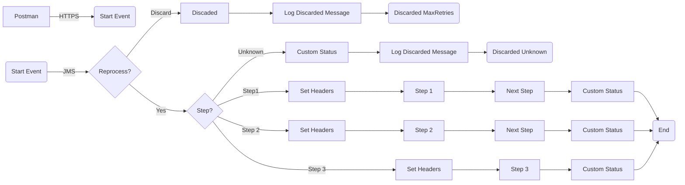

**iFlowId**: SEDA_Model_-_Single_Queue_-_Restart_and_Discard_MMZ - **iFlowVersion**: 1.0.1

**Mermaid Diagram**

**BPMN Diagram**

**Functional Summary**
- **Brief description of the iFlow**
This iFlow demonstrates a SEDA (Staged Event-Driven Architecture) model with a single queue. It receives a message, processes it through multiple steps, and handles potential exceptions. Messages exceeding the maximum retry count or with unknown steps are discarded.

- **Involved systems with Adapters Type and Endpoint Type**
    - SQUEUE: JMS (EndpointSender)
    - RQUEUE: JMS (EndpointReceiver)
    - Postman: HTTPS (EndpointSender)

- **Key steps**
    1.  Receive message from SQUEUE via JMS adapter.
    2.  Determine the next step based on the `Step` property in the message.
    3.  Process the message through steps `Step 1`, `Step 2`, `Step 3` as required.
    4.  Log exceptions if any occur during the steps.
    5.  If `SAPJMSRetries` exceeds `MaxRetries` discard the message.
    6.  Send the processed messages to RQUEUE via JMS adapter.

- **Message transformation**
    - Enricher: Used to create/delete properties in the message body and headers to set custom message processing log statuses.
    - Groovy scripts: Used for logging exceptions and discarded messages.

- **Externalized parameters list, configured values and their descriptions**
    - `MaxRetries`: 10 - Maximum number of retries before discarding a message.
    - `SEDA_MAIN_QUEUE`: SEDA_MODEL_MMZ - The name of the main JMS queue.
    - `Expiration Period`: 7 - Expiration period for messages.
    - `Maximum Retry Interval`: 1440 - Maximum retry interval in minutes.
    - `Retention Threshold 4 Alerting`: 1 - Retention threshold for alerting.
    - `Retry Interval`: 15 - Retry interval in minutes.
    - `Number of Concurrent Processes`: 1 - The number of concurrent processes for the JMS receiver adapter.

- **DataStore / JMS Dependency**
Yes

- **Cloud Connector Dependency**
Not Found

- **Common Scripts Dependency**
    - `Log_Exception_Async.groovy`, scriptBundleId: `Groovy_Logging_Scripts`
    - `Log_Discarded_Message.groovy`, scriptBundleId: `Groovy_Logging_Scripts`

- **ProcessDirect ComponentType Dependency**
Not Found