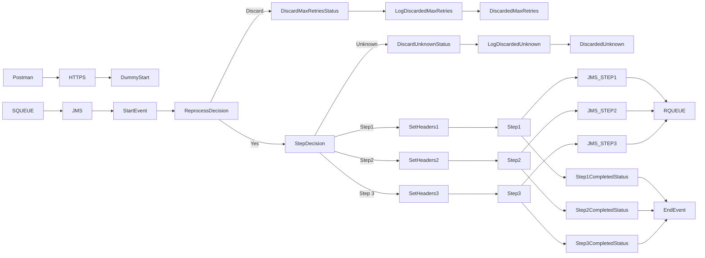

**iFlowId**: SEDA_Model_-_Single_Queue_-_Restart_and_Discard_MMZ - **iFlowVersion**: 1.0.1

**Mermaid Diagram**

**BPMN Diagram**

**Functional Summary**
- **Brief description of the iFlow**
  This iFlow implements a SEDA (Staged Event-Driven Architecture) model using a single JMS queue. It receives messages, processes them through a series of steps, and handles exceptions, retries, and discarding messages based on the number of retries.

- **Involved systems with Adapters Type and Endpoint Type**
  - SQUEUE: JMS - EndpointSender
  - Postman: HTTPS - EndpointSender
  - RQUEUE: JMS - EndpointRecevier

- **Key steps**
 1. Receive message via HTTPS or JMS.
 2. Set initial headers.
 3. Save initial message to JMS queue.
 4. Route message to Step 1, Step 2, or Step 3 based on the `Step` property.
 5. Each step prepares a message.
 6. Next steps send the message back to the JMS Queue
 7. If processing fails in a step, logs the exception asynchronously.
 8. If the message has been retried more than the maximum allowed times, discard the message after logging.

- **Message transformation**
  - Enricher components are used in the processes "Dummy Start", "Step 1", "Step 2", "Step 3" and "SEDA Router" to set headers and custom statuses.
  - Each step prepares the message for the next stage using the Enricher.

- **Externalized parameters list, configured values and their descriptions**
  - `MaxRetries`: 10 - Maximum number of retries before discarding a message.
  - `SEDA_MAIN_QUEUE`: SEDA_MODEL_MMZ - Name of the main JMS queue used for message processing.
  - `Expiration Period`: 7 - Expiration period (units not specified).
  - `Maximum Retry Interval`: 1440 - Maximum retry interval (units not specified).
  - `Retention Threshold 4 Alerting`: 1 - Retention threshold for alerting (units not specified).
  - `Retry Interval`: 15 - Retry interval (units not specified).
  - `Number of Concurrent Processes`: 1 - Number of concurrent processes for the JMS receiver adapter.

- **DataStore / JMS Dependency**
  Yes

- **Cloud Connector Dependency**
  Not Found

- **Common Scripts Dependency**
  - Log_Exception_Async.groovy - Groovy_Logging_Scripts
  - Log_Discarded_Message.groovy - Groovy_Logging_Scripts

- **ProcessDirect ComponentType Dependency**
  Not Found