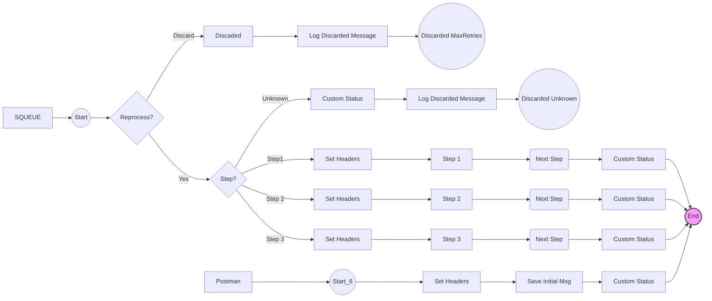

**iFlowId**: SEDA_Model_-_Single_Queue_-_Restart_and_Discard_MMZ - **iFlowVersion**: 1.0.1

**Mermaid Diagram**

**BPMN Diagram**

**Functional Summary**
- **Brief description of the iFlow**
This iFlow implements a SEDA (Staged Event-Driven Architecture) model with a single queue. It receives messages, processes them in multiple steps, and handles exceptions by logging them. Messages exceeding the maximum retry count are discarded.

- **Involved systems with Adapters Type and Endpoint Type**
    - SQUEUE: JMS (EndpointSender)
    - Postman: HTTPS (EndpointSender)
    - RQUEUE: JMS (EndpointRecevier)

- **Key steps**
    1. Receive a message via HTTPS or JMS.
    2. Route the message through three processing steps (Step 1, Step 2, Step 3).
    3. Each step prepares the message, sets headers, and potentially throws an exception.
    4. Exceptions are caught and logged asynchronously.
    5. If a message fails after exceeding the maximum retry count, it's discarded and logged.
    6. The message is then sent to the next step via JMS.
    7. At the end it completes with a status

- **Message transformation**
    - The `Set Headers` call activities create or update message headers like `SAP_Sender`, `SAP_Receiver`, and `SAP_MessageType`.
    - The `Prepare Step` call activities enrich the message body with step-specific data.
    - Custom Status call activities add a status to the message processing log

- **Externalized parameters list, configured values and their descriptions**
    - `MaxRetries`: 10 - Maximum number of retries before discarding a message.
    - `SEDA_MAIN_QUEUE`: SEDA_MODEL_MMZ - JMS Queue Name.
    - `Expiration Period`: 7 - Expiration Period in days?
    - `Maximum Retry Interval`: 1440 - Maximum retry interval in minutes?
    - `Retention Threshold 4 Alerting`: 1 - Number of messages to retain for alerting purposes?
    - `Retry Interval`: 15 - Retry interval in minutes?
    - `Number of Concurrent Processes`: 1 - Number of concurrent processes for JMS receiver adapter.

- **DataStore / JMS Dependency**
Yes

- **Cloud Connector Dependency**
Not Found

- **Common Scripts Dependency**
    - Log_Discarded_Message.groovy, scriptBundleId: Groovy_Logging_Scripts
    - Log_Exception_Async.groovy, scriptBundleId: Groovy_Logging_Scripts

- **ProcessDirect ComponentType Dependency**
Not Found