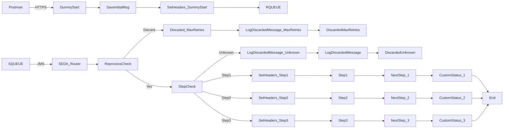

**iFlowId**: SEDA_Model_-_Single_Queue_-_Restart_and_Discard_MMZ - **iFlowVersion**: 1.0.1

**Mermaid Diagram**

**BPMN Diagram**

**Functional Summary**
- **Brief description of the iFlow**
  This iFlow implements a SEDA (Staged Event-Driven Architecture) pattern using a single JMS queue. It receives messages via HTTPS or JMS, processes them in multiple steps (Step 1, Step 2, Step 3), and sends the processed messages to the receiving queue. The iFlow includes error handling with retry and discard mechanisms.

- **Involved systems with Adapters Type and Endpoint Type**
  - Postman - HTTPS - EndpointSender
  - SQUEUE - JMS - EndpointSender
  - RQUEUE - JMS - EndpointRecevier

- **Key steps**
 1. Receive messages either via HTTPS (from Postman) or JMS (from SQUEUE).
 2. Enrich the message with headers (SAP_Sender, SAP_Receiver, SAP_MessageType) in "Dummy Start" and send to JMS Queue
 3. Based on the `Step` property, route the message to `Step 1`, `Step 2`, or `Step 3` integration processes.
 4. In each step, add Custom Status entries to the Message Processing Log, and send to JMS Queue
 5. After completing all the steps, the message processing is finished, setting status entries to the Message Processing Log. The process ends.
 6. If a message exceeds the maximum retry attempts (`MaxRetries`), it is discarded.

- **Message transformation**
  - The iFlow uses Enrichers to set headers (SAP_Sender, SAP_Receiver, SAP_MessageType) and custom status properties.
  - The iFlow manipulates message content by setting properties like `Step` to control routing, and adds Custom Status.
  - "Prepare Step 2", "Prepare Step 3" use Enrichers to prepare the message body and properties for subsequent steps.

- **Externalized parameters list, configured values and their descriptions**
  - `MaxRetries`: 10 - Maximum number of retries before discarding a message.
  - `SEDA_MAIN_QUEUE`: SEDA_MODEL_MMZ - The name of the main JMS queue used by the iFlow.
  - `Expiration Period`: 7 - Expiration period for JMS messages.
  - `Maximum Retry Interval`: 1440 - Maximum retry interval in minutes.
  - `Retention Threshold 4 Alerting`: 1 - Retention threshold for alerting purposes.
  - `Retry Interval`: 15 - Interval in minutes between retry attempts.
  - `Number of Concurrent Processes`: 1 - Number of concurrent processes for JMS receiver adapter.

- **DataStore / JMS Dependency**
  Yes

- **Cloud Connector Dependency**
  Not Found

- **Common Scripts Dependency**
  - Log_Exception_Async.groovy - Groovy_Logging_Scripts
  - Log_Discarded_Message.groovy - Groovy_Logging_Scripts

- **ProcessDirect ComponentType Dependency**
  Not Found