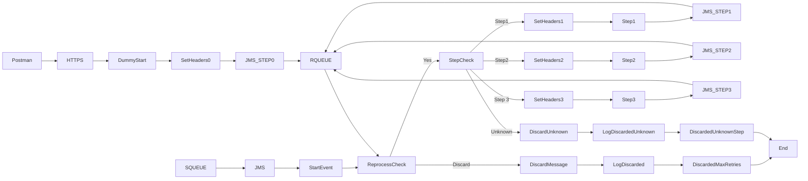

markdown
**iFlowId**: SEDA_Model_-_Single_Queue_-_Restart_and_Discard_MMZ - **iFlowVersion**: 1.0.1

**Mermaid Diagram**

**BPMN Diagram**

**Functional Summary**
- **Brief description of the iFlow**
  This iFlow simulates a message processing scenario using a SEDA (Staged Event-Driven Architecture) model with a single queue. It demonstrates message routing, error handling with retry mechanism, and message discarding based on maximum retries or unknown routing.

- **Involved systems with Adapters Type and Endpoint Type**
    - SQUEUE: JMS, EndpointSender
    - Postman: HTTPS, EndpointSender
    - RQUEUE: JMS, EndpointRecevier

- **Key steps**
    1. Receives a message via HTTPS from Postman.
    2. Sets initial headers and saves the message to the JMS queue (SEDA_MAIN_QUEUE).
    3. The SEDA Router receives the message from the JMS queue.
    4. The router determines the next processing step based on the "Step" property.
    5. If the step is Step1, Step2, or Step3, calls the corresponding local integration process.
    6. After each step, sends the message back to the JMS queue to trigger the next step.
    7. Includes logic to log Async Exceptions on Error Events
    8. If the message has been retried more than {{MaxRetries}} times, the message is discarded, otherwise is reprocessed.
    9. Logs discarded messages.

- **Message transformation**
    - The iFlow uses Enrichers to set headers and message content at various stages.
    - Enrichers create custom status messages.
    - Groovy scripts are used to Log discard messages and exception messages.

- **Externalized parameters list, configured values and their descriptions**
    - SEDA_MAIN_QUEUE: SEDA_MODEL_MMZ, Name of the JMS queue used for message processing.
    - Number of Concurrent Processes: 1, Number of concurrent processes for JMS receiver.
    - MaxRetries: 10, Maximum number of retries before a message is discarded.
    - Retry Interval: 15, Interval (in minutes) between retry attempts.
    - Maximum Retry Interval: 1440, Maximum interval (in minutes) between retry attempts.
    - Expiration Period: 7, Message Expiration Period
    - Retention Threshold 4 Alerting: 1, Retention Threshold for Alerting

- **DataStore / JMS Dependency**
    Yes

- **Cloud Connector Dependency**
    Not Found

- **Common Scripts Dependency**
    - Groovy_Logging_Scripts: Log_Discarded_Message.groovy
    - Groovy_Logging_Scripts: Log_Exception_Async.groovy

- **ProcessDirect ComponentType Dependency**
    Not Found