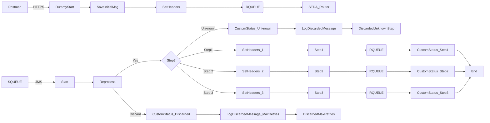

markdown
**iFlowId**: SEDA_Model_-_Single_Queue_-_Restart_and_Discard_MMZ - **iFlowVersion**: 1.0.1

**Mermaid Diagram**

**BPMN Diagram**

**Functional Summary**
-   **Brief description of the iFlow**
    This iFlow implements a SEDA (Staged Event-Driven Architecture) model with a single queue. It receives messages, processes them in multiple steps, and handles retries and discarding of messages based on configured parameters. It also includes exception handling and logging capabilities.

-   **Involved systems with Adapters Type and Endpoint Type**
    -   SQUEUE - JMS - EndpointSender
    -   Postman - HTTPS - EndpointSender
    -   RQUEUE - JMS - EndpointRecevier

-   **Key steps**
    1.  Receive message from HTTPS Endpoint (Postman).
    2.  Save the initial message and set initial headers.
    3.  Route message through SEDA Router to different processing steps (Step 1, Step 2, Step 3) based on `Step` property in message.
    4.  Each Step calls local integration processes.
    5.  Each Step set a custom status.
    6.  If the message fails and exceeds the maximum retries, it's discarded.
    7.  If the message is routed to an unknown step, it's also discarded.
    8.  Exceptions are logged asynchronously.

-   **Message transformation**
    -   Content Enricher to set and delete properties and headers in several steps.
    -   Groovy Script to Log discarded messages and Exceptions.

-   **Externalized parameters list, configured values and their descriptions**
    -   `MaxRetries`: 10 - Maximum number of retries before discarding the message.
    -   `SEDA_MAIN_QUEUE`: SEDA_MODEL_MMZ - Name of the main JMS queue used for message processing.
    -   `Expiration Period`: 7 - Message expiration period in days.
    -   `Maximum Retry Interval`: 1440 - Maximum retry interval in minutes.
    -   `Retention Threshold 4 Alerting`: 1 - Retention threshold for alerting purposes.
    -   `Retry Interval`: 15 - Retry interval in minutes.
    -   `Number of Concurrent Processes`: 1 - Number of concurrent processes for JMS adapter.

-   **DataStore / JMS Dependency**: Yes

-   **Cloud Connector Dependency**: Not Found

-   **Common Scripts Dependency**
    -   Log_Discarded_Message.groovy - Groovy_Logging_Scripts
    -   Log_Exception_Async.groovy - Groovy_Logging_Scripts

-   **ProcessDirect ComponentType Dependency**: Not Found