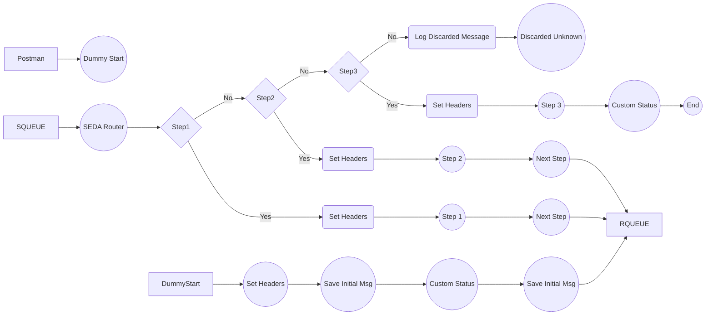

**iFlowId**: SEDA_Model_-_Single_Queue_-_Restart_and_Discard_MMZ - **iFlowVersion**: 1.0.1

**Mermaid Diagram**

**Functional Summary**
- **Brief description of the iFlow**
This iFlow demonstrates a SEDA (Staged Event-Driven Architecture) model with a single queue. It receives messages, processes them through a series of steps, and handles exceptions, retries, and discarding of messages exceeding the maximum retry count.

- **Involved systems with Adapters Type and Endpoint Type**
    - SQUEUE: JMS (EndpointSender)
    - RQUEUE: JMS (EndpointRecevier)
    - Postman: HTTPS (EndpointSender)

- **Key steps**
 1. Receive message from SQUEUE via JMS Adapter.
 2. Determine if the message should be reprocessed based on retry count. If retry count exceeds the maximum defined, discard the message.
 3. Route message to Step 1, Step 2, or Step 3 based on the `Step` property.
 4. Each step calls a local integration process which prepares the data and logs to the message processing log.
 5. If a step is unknwon it will log to message processing log and the flow will be discarded.
 6. Steps 1,2, and 3 trigger exception subprocesses for error handling and logging when exceptions occur.

- **Message transformation**
    - The iFlow uses Enrichers to set headers (SAP_Sender, SAP_Receiver, SAP_MessageType) and properties (Step) at various stages.
    - Each Step integration process uses an Enricher to prepare the message to the next step.

- **Externalized parameters list, configured values and their descriptions**
    - `MaxRetries`: 10 - Maximum number of retries before discarding a message.
    - `SEDA_MAIN_QUEUE`: SEDA_MODEL_MMZ - The JMS queue name used for message exchange.
    - `Expiration Period`: 7 - Message Expiration Period
    - `Maximum Retry Interval`: 1440 - Maximum time to retry
    - `Retention Threshold 4 Alerting`: 1 - Retention threshold
    - `Retry Interval`: 15 - Interval between retries in minutes.
    - `Number of Concurrent Processes`: 1 - Number of concurrent processes to handle JMS messages.

- **DataStore / JMS Dependency**
Yes

- **Cloud Connector Dependency**
Not Found

- **Common Scripts Dependency**
    - Groovy_Logging_Scripts: Log_Discarded_Message.groovy
    - Groovy_Logging_Scripts: Log_Exception_Async.groovy

- **ProcessDirect ComponentType Dependency**
Not Found
