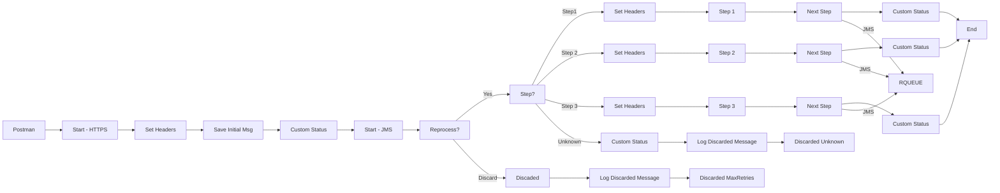
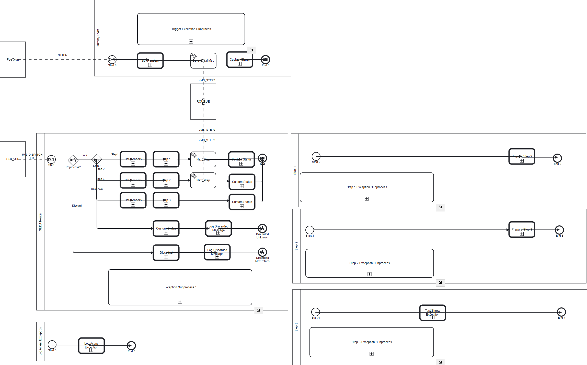

markdown
**iFlowId**: SEDA_Model_-_Single_Queue_-_Restart_and_Discard_MMZ - **iFlowVersion**: 1.0.1

**Mermaid Diagram**

**BPMN Diagram**

**Functional Summary**
- **Brief description of the iFlow**
This iFlow demonstrates a SEDA (Staged Event-Driven Architecture) model using a single JMS queue. Messages are processed in multiple steps, with retry and discard mechanisms in place to handle errors and prevent indefinite reprocessing. It exposes an HTTPS endpoint to trigger the flow.

- **Involved systems with Adapters Type and Endpoint Type**
  - SQUEUE: JMS (Endpoint Sender)
  - RQUEUE: JMS (Endpoint Receiver)
  - Postman: HTTPS (Endpoint Sender)

- **Key steps**
 1.  Receive message via HTTPS.
 2.  Save the initial message using the "Dummy Start" process and set headers.
 3.  Route the message based on the `Step` property:
    -   Step1: Call "Step 1" local integration process.
    -   Step2: Call "Step 2" local integration process.
    -   Step3: Call "Step 3" local integration process.
    -   Unknown: Discard the message.
 4.  Each "Step" process enriches the message, throws an exception if requested, creates a custom status log and calls the "Log Async Exception" process in case of error before ending.
 5.  After each process call, the message is sent to the next step.
 6.  If the message processing fails after a certain number of retries (MaxRetries), the message is discarded. This is controlled by the 'SAPJMSRetries' header and a conditional check.
 7.  Discarded message is logged using a Groovy script and the iFlow ends.

- **Message transformation**
  - Enricher components are used to set headers, properties, and body content.

- **Externalized parameters list, configured values and their descriptions**
  - `MaxRetries`: 10 (Maximum number of retries before discarding a message)
  - `SEDA_MAIN_QUEUE`: SEDA_MODEL_MMZ (Name of the JMS queue)
  - `Expiration Period`: 7 (Message expiration period in days)
  - `Maximum Retry Interval`: 1440 (Maximum interval in minutes to retry)
  - `Retention Threshold 4 Alerting`: 1 (Retention threshold for alerting purposes)
  - `Retry Interval`: 15 (Interval in minutes to retry)
  - `Number of Concurrent Processes`: 1 (Number of concurrent processes)

- **DataStore / JMS Dependency**
Yes

- **Cloud Connector Dependency**
Not Found

- **Common Scripts Dependency**
  - Groovy_Logging_Scripts: Log_Discarded_Message.groovy
  - Groovy_Logging_Scripts: Log_Exception_Async.groovy

- **ProcessDirect ComponentType Dependency**
Not Found