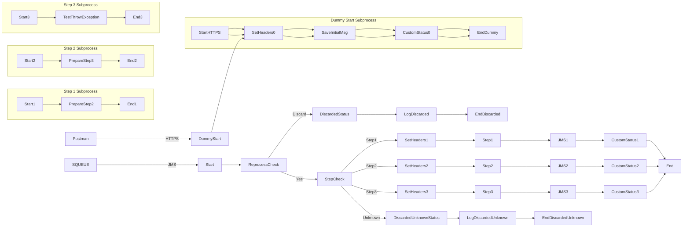

markdown
**iFlowId**: SEDA_Model_-_Single_Queue_-_Restart_and_Discard_MMZ - **iFlowVersion**: 1.0.1

**Mermaid Diagram**

**Functional Summary**
- **Brief description of the iFlow**
This iFlow demonstrates a SEDA (Staged Event-Driven Architecture) model with a single queue, incorporating restart and discard mechanisms for message processing. It receives messages, processes them through several steps, and handles exceptions by logging them and potentially discarding messages exceeding retry limits.

- **Involved systems with Adapters Type and Endpoint Type**
    - SQUEUE (Sender): JMS, EndpointSender
    - Postman (Sender): HTTPS, EndpointSender
    - RQUEUE (Receiver): JMS, EndpointRecevier

- **Key steps**
    1.  Receive message via HTTPS or JMS.
    2.  Initial message processing and saving (Dummy Start process).
    3.  Route message through processing steps (Step 1, Step 2, Step 3 processes).
    4.  Send message to the next step via JMS.
    5.  Handle exceptions and potentially discard messages exceeding retry limits.

- **Message transformation**
    - Enrichers are used to set headers and properties at various steps.
    - Groovy scripts are used for logging exceptions and discarded messages.

- **Externalized parameters list, configured values and their descriptions**
    - `MaxRetries`: 10 - Maximum number of retries before discarding a message.
    - `SEDA_MAIN_QUEUE`: SEDA_MODEL_MMZ - The name of the main JMS queue used for message processing.
    - `Expiration Period`: 7 - Expiration period of the message in days.
    - `Maximum Retry Interval`: 1440 - Maximum interval for retries in minutes.
    - `Retention Threshold 4 Alerting`: 1 - Retention threshold for alerting.
    - `Retry Interval`: 15 - Interval between retries in minutes.
    - `Number of Concurrent Processes`: 1 - Number of concurrent processes for JMS receiver adapter.

- **DataStore / JMS Dependency**
Yes

- **Cloud Connector Dependency**
Not Found

- **Common Scripts Dependency**
    - Log_Discarded_Message.groovy, scriptBundleId: Groovy_Logging_Scripts
    - Log_Exception_Async.groovy, scriptBundleId: Groovy_Logging_Scripts

- **ProcessDirect ComponentType Dependency**
Not Found