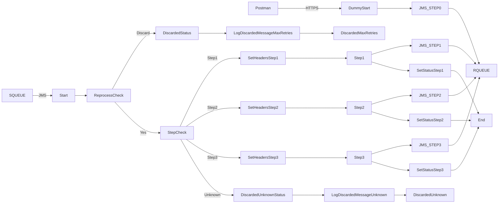

markdown
**iFlowId**: SEDA_Model_-_Single_Queue_-_Restart_and_Discard_MMZ - **iFlowVersion**: 1.0.1

**Mermaid Diagram**

**Functional Summary**
- **Brief description of the iFlow**
This iFlow demonstrates a SEDA (Staged Event-Driven Architecture) pattern with a single queue. It receives messages, processes them in multiple steps, and handles exceptions. Messages can be reprocessed, and discarded after a maximum number of retries or if the receiver is not found.

- **Involved systems with Adapters Type and Endpoint Type**
    - SQUEUE: JMS, EndpointSender
    - Postman: HTTPS, EndpointSender
    - RQUEUE: JMS, EndpointRecevier

- **Key steps**
    1.  Receive message via HTTPS or JMS.
    2.  Set headers for the initial step.
    3.  Process message in Step 1, Step 2, and Step 3 (local integration processes).
    4.  Route messages based on the 'Step' property.
    5.  If an error occurs in any step, log the exception and set a custom status.
    6.  Discard messages that exceed the maximum number of retries or have an unknown step.

- **Message transformation**
    - Enricher components are used to create and delete message headers and properties.
    - Groovy scripts are used to log exceptions and discarded messages.

- **Externalized parameters list, configured values and their descriptions**
    - `MaxRetries`: 10 - Maximum number of retries before discarding a message.
    - `SEDA_MAIN_QUEUE`: SEDA_MODEL_MMZ - Name of the main JMS queue.
    - `Expiration Period`: 7 - Expiration period for messages.
    - `Maximum Retry Interval`: 1440 - Maximum retry interval.
    - `Retention Threshold 4 Alerting`: 1 - Retention threshold for alerting.
    - `Retry Interval`: 15 - Retry interval.
    - `Number of Concurrent Processes`: 1 - Number of concurrent processes.

- **DataStore / JMS Dependency**
Yes

- **Cloud Connector Dependency**
Not Found

- **Common Scripts Dependency**
    - Log_Exception_Async.groovy (Groovy_Logging_Scripts)
    - Log_Discarded_Message.groovy (Groovy_Logging_Scripts)

- **ProcessDirect ComponentType Dependency**
Not Found