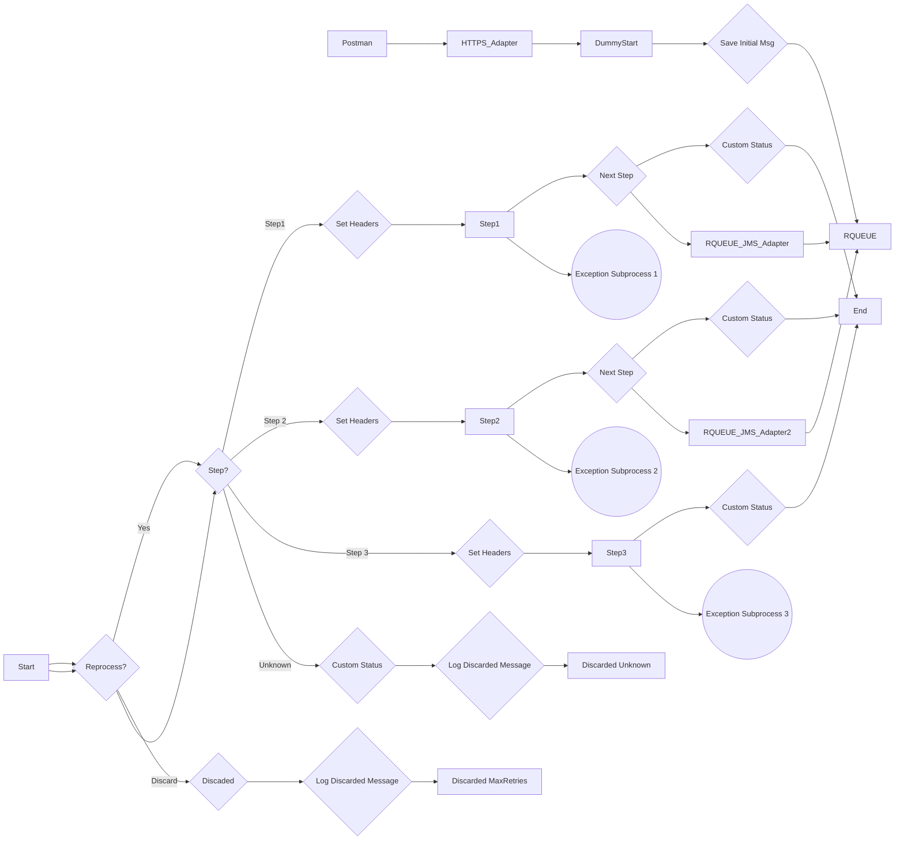

markdown
**iFlowId**: SEDA_Model_-_Single_Queue_-_Restart_and_Discard_MMZ - **iFlowVersion**: 1.0.1

**Mermaid Diagram**

**BPMN Diagram**

**Functional Summary**
- **Brief description of the iFlow**
  This iFlow demonstrates a SEDA (Staged Event-Driven Architecture) pattern with a single queue. It receives a message, processes it through multiple steps, and then sends it to a JMS queue.  It also includes error handling, retry mechanisms, and message discarding based on the number of retries or unknown steps.

- **Involved systems with Adapters Type and Endpoint Type**
  - SQUEUE: JMS (EndpointSender)
  - Postman: HTTPS (EndpointSender)
  - RQUEUE: JMS (EndpointRecevier)

- **Key steps**
  1. Receive a message via HTTPS from Postman.
  2. Save the initial message and set headers.
  3. Route the message through steps 1, 2, and 3 based on the `Step` property.
  4. Each step prepares the message content, executes a direct call to a local integration process, and updates message processing log custom status.
  5.  If message processing fails during the steps, an exception subprocess logs the async exception.
  6. If the number of retries exceeds the maximum allowed, the message is discarded and logged. If the message's 'Step' property does not match any route conditions (Step1, Step2, Step3), it is also discarded.
  7. The final message is sent to a JMS queue.

- **Message transformation**
  - Setting of headers for sender, receiver, and message type.
  - Enrichment of message processing log with custom statuses.
  - The content of each step is wrapped into Envelope/MessageB64

- **Externalized parameters list, configured values and their descriptions**
  - `MaxRetries`: 10 - Maximum number of retries before discarding the message.
  - `SEDA_MAIN_QUEUE`: SEDA_MODEL_MMZ - Name of the JMS queue used for message processing.
  - `Expiration Period`: 7 - Expiration period for the JMS message.
  - `Maximum Retry Interval`: 1440 - Maximum retry interval in minutes.
  - `Retention Threshold 4 Alerting`: 1 - Retention threshold for alerting.
  - `Retry Interval`: 15 - Retry interval in minutes.
  - `Number of Concurrent Processes`: 1 - Number of concurrent processes for the JMS adapter.

- **DataStore / JMS Dependency**
  Yes

- **Cloud Connector Dependency**
  Not Found

- **Common Scripts Dependency**
  - Groovy_Logging_Scripts: Log_Discarded_Message.groovy
  - Groovy_Logging_Scripts: Log_Exception_Async.groovy

- **ProcessDirect ComponentType Dependency**
  Not Found